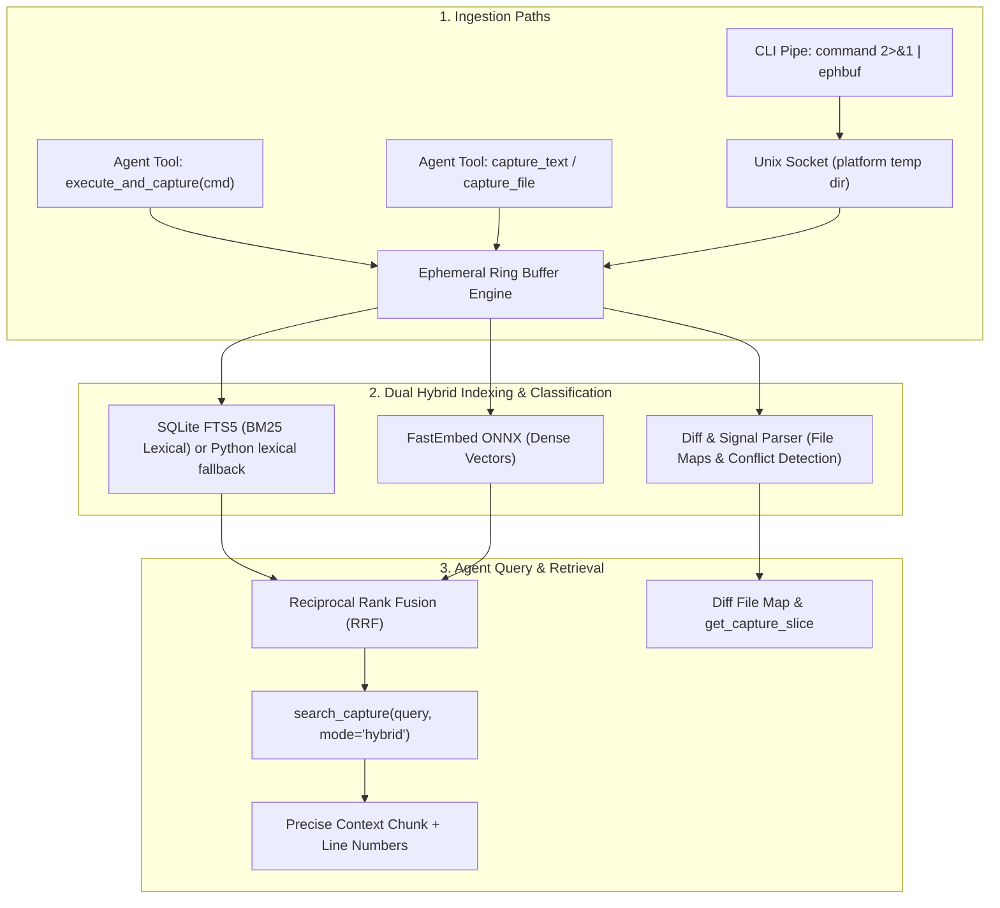

# Ephemeral Buffer MCP Server (`ephemeral-buffer`)

[](https://github.com/k-rister/ephemeral-buffer-mcp/actions/workflows/ci.yml)
[](https://github.com/k-rister/ephemeral-buffer-mcp/blob/main/LICENSE)
[](https://www.python.org/)
[](https://pypi.org/project/ephemeral-buffer-mcp/)
[](https://codecov.io/gh/k-rister/ephemeral-buffer-mcp)

An ephemeral in-memory command output capture and hybrid search engine (BM25 + Semantic Embeddings) for AI coding assistants (Claude Code, Antigravity, Cursor, etc.).

---

## 🎯 The Problem This Solves

When coding agents run commands that generate large outputs (thousands of lines of build logs, test runs, stack traces, JSON dumps), agents face two failure modes:
1. **Context Pollution:** Ingesting megabytes of raw text blows out token limits and degrades model reasoning.
2. **Blind Bash Filtering:** Agents waste multiple turns running `head`, `tail`, `grep`, and `awk` trying to guess error patterns.

## 💡 The Solution

`ephemeral-buffer` provides a transient in-memory ring buffer with **Dual Hybrid Indexing** and **Content-Aware Structure Parsing**:
- **BM25 Lexical Search (SQLite FTS5):** For exact matches on error codes (`NullPointerException`, `ECONNREFUSED`, `exit 137`, HTTP `502`). Builds without SQLite FTS5 use a complete token-based Python fallback with lower ranking performance.
- **Dense Semantic Vector Search (FastEmbed ONNX):** For fuzzy conceptual queries (*"Where did the DB connection pool fail?"* or *"Why did authentication fail?"*).
- **Unified Diff Structural Mapping:** Automatically detects git diffs and PR diffs (`gh pr diff`, `git show`, `git diff`), parses modified files, additions/deletions, and generates a line-indexed file map in the summary.
- **Smart Signal Filtering:** Scans command/build/test logs for diagnostic keywords, suppresses false positives in diffs and source code, and accurately captures test runner failures, unhandled exceptions, and merge conflicts. Use `content_type='log'` when a plain-text capture should be signal-scanned.
- Successful test-run summaries such as `OK` or `25 passed` suppress fixture-only error and failure keywords while retaining the original output for search.
- **Reciprocal Rank Fusion (RRF):** Blends lexical and semantic ranking for high precision retrieval.
- **LRU Capture Eviction:** Holds up to 25 captures and 50 MiB of captured content by default, evicting the least recently used captures when either limit is reached.
- **Thread-Safe Shared Engine:** Serializes ingestion, search, LRU updates, eviction, and cleanup across MCP requests and CLI socket clients.

---

## 📦 Installation

### Requirements

- Python 3.10 or newer
- A supported MCP client if you want to use the server from an AI coding assistant
- Network access on first use if FastEmbed needs to download its embedding model

The package is installed from PyPI as `ephemeral-buffer-mcp`. It provides both
the MCP server and the `ephbuf` command-line client.

### Recommended: install from PyPI

Create an isolated virtual environment and install the latest published
package:

```bash
python3 -m venv .venv
.venv/bin/python -m pip install --upgrade pip
.venv/bin/python -m pip install ephemeral-buffer-mcp
```

Verify that the CLI is available:

```bash
.venv/bin/ephbuf --help
```

On Windows, use the equivalent commands from the virtual environment's
`Scripts` directory:

```powershell
py -3 -m venv .venv
.venv\Scripts\python.exe -m pip install --upgrade pip
.venv\Scripts\python.exe -m pip install ephemeral-buffer-mcp
.venv\Scripts\ephbuf.exe --help
```

To upgrade or remove the package:

```bash
.venv/bin/python -m pip install --upgrade ephemeral-buffer-mcp
.venv/bin/python -m pip uninstall ephemeral-buffer-mcp
```

### Install from a source checkout

Use an editable install when developing or testing local changes:

```bash
git clone https://github.com/k-rister/ephemeral-buffer-mcp.git
cd ephemeral-buffer-mcp
python3 -m venv .venv
.venv/bin/python -m pip install --upgrade pip
.venv/bin/python -m pip install -e .
```

The editable install exposes the same `ephbuf` command and MCP server as the
PyPI installation. The reproducible, locked contributor environment is
documented in [Testing the Server](#-testing-the-server).

When launching from a source checkout with `run.sh`, the launcher prefers
`.venv/bin/python`, then supports the legacy `venv/bin/python` layout, before
using an explicit `PYTHON` override or `python3`. An invalid `PYTHON` override
fails with an actionable error.

### Start the MCP server manually

The MCP server uses stdio for communication with the MCP host. Start it with
the Python interpreter from the environment where the package was installed:

```bash
.venv/bin/python -m server
```

Normally you should let your MCP client start this process automatically. Do
not start a separate server for every shell command: the `ephbuf` CLI sends
captures to the running server over its local Unix socket.
The private CLI socket uses versioned length-prefixed request and response
frames, so fragmented reads do not depend on half-closing the connection.

### Start an isolated Codex session

When using the global Codex MCP configuration, start Codex through the
installed `codex-ephemeral` launcher. From a source checkout, use
`./codex-ephemeral`. The launcher creates a unique
`EPHEMERAL_SESSION_ID` and exports it to Codex, the MCP server, and `ephbuf`.
It also passes the ID explicitly through Codex's MCP configuration so it is
available even when Codex sanitizes the MCP child environment.
The global configuration requires this identity, so starting Codex directly
will fail closed instead of attaching to another session's socket.

The launcher also enables `EPHEMERAL_ALLOW_STDIO_WITHOUT_SOCKET=1` because some
Codex execution environments deny Unix-socket creation. In that case MCP over
stdio remains available and runtime diagnostics report the socket failure;
`ephbuf` CLI support remains available when the environment permits socket
creation.

### Configure other coding agents

The server is not Codex-specific. Any MCP client that launches a local stdio
server can use the same command and environment settings:

```json
{
  "mcpServers": {
    "ephemeral-buffer": {
      "command": "/absolute/path/to/ephemeral-buffer-mcp/run.sh",
      "args": [],
      "env": {
        "EPHEMERAL_REQUIRE_ISOLATION": "1",
        "EPHEMERAL_SESSION_ID": "agent-session-unique-value",
        "EPHEMERAL_ALLOW_STDIO_WITHOUT_SOCKET": "1"
      }
    }
  }
}
```

This shape applies to clients such as Claude-style `.mcp.json` and
Gemini/Antigravity-style `mcp_config.json`. Use a different
`EPHEMERAL_SESSION_ID` for every concurrent agent session. If the client
supports environment interpolation, use its per-session identifier; otherwise
generate an ID when starting the agent and place that same value in the
agent's shell environment:

```bash
export EPHEMERAL_SESSION_ID="agent-$(date +%s)-$$"
export EPHEMERAL_REQUIRE_ISOLATION=1
export EPHEMERAL_ALLOW_STDIO_WITHOUT_SOCKET=1
```

The MCP server and `ephbuf` CLI must inherit the same ID. An MCP client that
does not pass environment variables to child processes can still use the MCP
tools, but its separate `ephbuf` shell commands will need an equivalent
session environment configured independently.

For other shell-launched agents, use the installed generic launcher. From a
source checkout, use `./ephemeral-agent`:

```bash
ephemeral-agent claude
ephemeral-agent gemini
```

Or source the environment into an existing shell before launching the agent:

```bash
source ephemeral-session-env
claude   # or another coding-agent command
```

GUI-launched agents still need their MCP configuration to provide a unique
session ID per conversation; these scripts cannot modify an already-running
GUI process.

### Configure an MCP client

MCP clients generally need the command, arguments, and environment used to
start a stdio server. A portable configuration looks like this:

```json
{
  "mcpServers": {
    "ephemeral-buffer": {
      "command": "/absolute/path/to/ephemeral-buffer-mcp/.venv/bin/python",
      "args": ["-m", "server"]
    }
  }
}
```

Replace the command with the absolute path to the virtual-environment Python
interpreter. Using an absolute path avoids differences between GUI-launched
clients and interactive shells. On Windows, use a path such as
`C:\\path\\to\\ephemeral-buffer-mcp\\.venv\\Scripts\\python.exe`.

For clients that provide a command-line registration command, register the
same executable and arguments conceptually as:

```text
command: /absolute/path/to/.venv/bin/python
arguments: -m server
```

After saving the configuration, restart or reload the MCP client and confirm
that the `ephemeral-buffer` tools appear. The server exposes capture, search,
summary, slice, consolidation, diagnostics, and cleanup tools; the `ephbuf`
CLI is a separate convenience client for shell output.

### Isolate concurrent agent sessions

For a coding agent that may run alongside another agent, configure the same
session identity for the MCP server and the `ephbuf` CLI:

```json
"env": {
  "EPHEMERAL_REQUIRE_ISOLATION": "1",
  "EPHEMERAL_SESSION_ID": "agent-session-1"
}
```

The server and CLI then derive the same session-specific socket, while a
missing identity fails closed instead of falling back to the shared legacy
socket. `EPHEMERAL_SOCKET_PATH` may be used instead when the launcher assigns
the socket path directly. The MCP initialization instructions describe this
policy to the client, but the environment checks enforce it independently.

The CLI bounds each socket connect, send, and receive operation to 10 seconds
by default. Set `EPHEMERAL_SOCKET_TIMEOUT_SECONDS` to a positive number of
seconds when a different limit is appropriate; timeout failures return a
nonzero CLI result.

### Background model warm-up

After socket startup succeeds, the server loads FastEmbed and runs a small
deterministic embedding in a background thread. MCP startup and BM25 search do
not wait for this work. A semantic request arriving during warm-up waits on the
same model lock instead of starting a duplicate load. Subsequent operations use
the local model cache. To disable warm-up for lexical-only or memory-constrained
deployments, or to select a compatible model and cache location, set:

```bash
export EPHEMERAL_EMBEDDING_WARMUP=0
export EPHEMERAL_EMBEDDING_MODEL="BAAI/bge-small-en-v1.5-fp32"
export EPHEMERAL_FASTEMBED_CACHE_DIR="$HOME/.cache/ephemeral-buffer"
```

The default model is `BAAI/bge-small-en-v1.5-fp32`, the upstream fp32 ONNX
export of bge-small-en-v1.5 (about 130 MB), which the server registers with
FastEmbed itself. FastEmbed's own catalogue entry, selectable as
`BAAI/bge-small-en-v1.5`, is a smaller reduced-precision export that produces
identical vectors but whose matrix kernels do not parallelize on common CPU
hosts; measured first-search latency with it was 3x to 23x worse. Embedding
inference uses ONNX Runtime's default thread count; bound it with
`EPHEMERAL_EMBEDDING_THREADS` when the server shares a host with an
interactive coding agent, and check both settings on the deployment host with
`benchmark_semantic_index.py`. `get_buffer_stats` reports the active thread
setting.

```bash
export EPHEMERAL_EMBEDDING_THREADS=4
```

Warm-up failures do not stop the server. BM25 remains available, and hybrid
search returns lexical results with a `semantic_fallback` error-class field
when semantic initialization fails. `get_buffer_stats` and
`get_runtime_diagnostics` report warm-up as `not-started`, `loading`, `ready`,
`failed`, or `disabled`; failures expose only the exception class.

Lexical and semantic search index different chunk grids. BM25 keeps four-line
sliding windows with two-line overlap so exact line ranges stay tight. Semantic
embeddings use separate windows packed from consecutive lines, closed at eight
lines or 1,024 UTF-8 bytes, whichever comes first, with no overlap. That keeps
every window inside the model's token limit and, because embedding cost tracks
total tokens, roughly halves the work by not embedding the overlap twice. Hybrid ranking fuses the
two grids in line space: a semantic window boosts the lexical hits it overlaps
and appears on its own only when nothing lexical matched inside it. Each match
reports `chunk_index` as `lexical` or `semantic` alongside its line range. Tune
the windows when output has very long or very short lines:

```bash
export EPHEMERAL_SEMANTIC_CHUNK_LINES=8
export EPHEMERAL_SEMANTIC_CHUNK_BYTES=1024
export EPHEMERAL_SEMANTIC_CHUNK_OVERLAP=0
```

Larger windows embed fewer chunks but dilute single-line signals and cost more
per token; overlap improves recall across window boundaries at proportional
embedding cost. Compare strategies on the deployment host with
`benchmark_semantic_index.py --semantic-chunk-lines ... --semantic-chunk-overlap ...`.

Semantic indexing can optionally be prefetched after ingestion:

```bash
export EPHEMERAL_SEMANTIC_PREFETCH=1
export EPHEMERAL_SEMANTIC_PREFETCH_WORKERS=1
```

Prefetch is disabled by default. When enabled, every eligible capture is queued
at ingestion and a bounded worker pool drains the queue newest-first, since the
latest capture is the most likely search target; a burst of captures is never
silently skipped. A semantic or hybrid search waits for a job that is already
running, and pulls a still-queued capture out of the queue to index it inline
so it does not wait behind older work. Failed jobs retry through the normal
lazy path, and evicted or cleared captures drop their queued work. Embedding
inference is serialized by one model lock, so extra workers only overlap
bookkeeping; tune `EPHEMERAL_EMBEDDING_THREADS` instead of the worker count
for throughput. `get_buffer_stats` and `get_runtime_diagnostics` expose only
aggregate pending, queued, running, and failed counts.

The exact model and cache location can also be supplied in the MCP client's
`env` configuration. Keep the model cache writable by the user running the
MCP client.

### Installation choices at a glance

| Use case | Recommended installation |
| :--- | :--- |
| Normal user | PyPI install in a virtual environment |
| MCP host | PyPI install, then configure the installed server command |
| Shell/CLI use | PyPI install, then run `ephbuf` |
| CLI coding agent | PyPI install, then run `ephemeral-agent` or `codex-ephemeral` |
| Contributor | Source checkout with `pip install -e .` |
| Release validation | Follow the procedures in [OPERATIONS.md](OPERATIONS.md) |

If the MCP client cannot find the server, check the absolute interpreter path,
the selected Python environment, and the client's server logs. For socket,
capture-limit, logging, and deployment troubleshooting, see
[OPERATIONS.md](OPERATIONS.md).

---

## 🏗 Architecture & Flow



---

## 🚀 How to Use It

### 1. From the Terminal (CLI Pipe via `ephbuf`)
You can pipe command output directly into the running MCP server:

```bash
# Pipe any command output into the buffer
pytest -v 2>&1 | ephbuf --label "pytest run"

# Pipe git diffs directly
git diff HEAD~3 | ephbuf --label "feature diff" --type diff

# Or wrap command execution
ephbuf --label "backend build" -- cargo build --verbose
```

The optional `--type`/`-t` hint accepts `auto` (the default), `diff`, `log`, or
`text`. Use `diff` for unified patches when automatic detection is ambiguous;
otherwise `auto` classifies diffs, build/test logs, and plain text from the
content and label.

`ephbuf` also bounds wrapped-command and piped-stdin capture with
`--max-output-bytes`; it defaults to `EPHEMERAL_MAX_BUFFER_BYTES` or 50 MiB and
retains the beginning and end of oversized output.
Use `--timeout-seconds` to stop a wrapped command after a bounded runtime; timed
out commands retain the output collected so far and exit with status 124.
Requested `max_output_bytes` and `capture_file` `max_bytes` values may not
exceed the configured buffer byte limit; the tools return a validation error
instead of silently clamping them.

### 2. From the AI Agent via MCP Tools

The agent has access to the following tools:

| Tool | Purpose |
| :--- | :--- |
| `execute_and_capture(command, cwd, label, content_type='auto', max_output_bytes=None, timeout_seconds=None, structured_metrics=None)` | Executes a shell command with bounded capture and returns a compact versioned JSON summary containing status, duration, sizes, approximate token counts, truncation, warnings/errors, and optional structured metrics. |
| `preflight_command(command, cwd=None)` | Performs content-free path, symlink, local Git-root, and executable-resolution diagnostics without executing the requested command. |
| `start_execution(phases, execution_id=None, label='', resume_policy='safe', cwd=None, timeout_seconds=None, max_output_bytes=None)` | Runs a sequential, durably checkpointed set of command phases and returns phase statuses, metrics, and a partial/completed marker. |
| `resume_execution(execution_id, retry_failed=False, confirm_unsafe=False)` | Resumes from the first incomplete phase, skipping completed phases; retries and unsafe side effects require explicit controls. |
| `get_execution(execution_id, include_output=False)` | Retrieves persisted phase metadata, event history, retry requirements, and human/machine-readable completion status. |
| `get_execution_output(execution_id, phase_name=None, offset=0, max_bytes=8192)` | Retrieves a bounded output chunk persisted for all phases or one phase, including after a server restart; use `offset` to continue a large phase. |
| `list_executions(limit=20, offset=0)` | Lists a bounded page of durable executions and their partial/completed summaries; oversized pages return compact IDs with pagination metadata. |
| `capture_text(content, label, content_type='auto', structured_metrics=None)` | Ingests text directly into the buffer and returns the same compact summary schema. |
| `capture_file(file_path, label, content_type='auto', max_bytes=None, structured_metrics=None)` | Ingests a bounded log/output file from disk and returns the same compact summary schema. |
| `consolidate_captures(capture_ids, label, max_captures=25, max_bytes=None)` | Creates one bounded, searchable JSON capture from multiple captures while preserving source IDs and source line numbers. |
| `search_capture(query, mode, top_k, context_lines)` | Hybrid/BM25/Semantic search over the captured output. BM25 splits underscores and punctuation—including regex-like characters—into alphanumeric terms, then combines those terms with OR. For example, `database_connection` searches for `database` or `connection`, not one underscore-containing term. Hybrid ranking gives lexical matches priority over semantic-only matches. Returns matching chunks with surrounding context lines, exact numeric context boundaries, raw context, line numbers, and whether the match came from the lexical or semantic chunk grid. Search snippets bound each formatted line to 8 KiB of UTF-8 and the complete response to 64 KiB; use `get_capture_slice` for omitted content. |
| `get_capture_slice(start_line, end_line)` | Retrieves exact line ranges to inspect full stack traces, logs, or specific diff files. |
| `get_capture_summary(capture_id, include_previews=False)` | Returns the compact JSON summary; opt into bounded head/tail previews only when needed. |
| `get_buffer_stats()` | Reports aggregate capture count, content bytes, lines, chunks, embedding model readiness, embedding bytes, accounted bytes, and process RSS. When local metrics are enabled, it also includes the content-free aggregate metrics snapshot. |
| `get_runtime_diagnostics()` | Opt-in, content-free report of runtime version, platform, uptime, socket mode, buffer limits, embedding readiness, and process memory. |
| `set_semantic_index_budget(max_indexed_chunks)` | Adjusts the session's semantic-index chunk budget when `EPHEMERAL_ALLOW_RUNTIME_INDEX_BUDGET=1`; decreases evict least-recently-used captures as needed. |
| `list_captures()` | Lists active captures in the ring buffer. |
| `clear_captures(capture_id)` | Clears buffer. |

Capture tools return a compact JSON summary so an agent can decide whether it
needs the full output before spending context on retrieval. The summary uses
`schema_version: 1` and includes `status` (`captured`, `success`, `failed`, or
`timed_out`), `duration_ms`, retained and original byte sizes, approximate
token counts, truncation and partial-execution flags, typed warning/error
signals, and bounded caller-provided `structured_metrics`. The token values
are deterministic planning estimates based on four UTF-8 bytes per token;
they are not provider billing counts. Use `get_capture_summary` for the
compact form, set `include_previews=True` only when a head/tail sample is
useful, and use `get_capture_slice` or `search_capture` for complete or
targeted content. Diff file maps are also bounded and report omitted entries;
use `get_capture_slice` for the complete diff. Raw retained captures are
unchanged by summary generation.

The deterministic summary benchmark measures the initial agent-prompt
reduction for representative successful, failed, noisy, truncated, and
timed-out captures. It exercises the public capture API, compares a
parent-contract formatted-text response with the current compact
summary-first decision prompt, and verifies through the public slice API that
retained output can still be retrieved unchanged. The parent response is
reconstructed from the prior `execute_and_capture` contract; the current path
uses the public compact response. The proxy divides UTF-8 prompt bytes by four
and is intended for regression comparison, not provider billing or exact
token accounting. Execution summaries also bound command and label metadata
so unusually long shell commands cannot re-expand the initial response.

To generate the machine-readable benchmark record:

```bash
.venv/bin/python benchmark_effectiveness.py --summary --output /tmp/capture-summary.json
```

Choose the execution path based on the output and inspection goal:

- Use direct command execution for a small, targeted inspection where the
  output is already bounded and immediate terminal feedback is sufficient.
- Use `execute_and_capture` once output may be noisy, large, or uncertain—such
  as tests, builds, and logs—because it bounds context and makes later search
  and exact retrieval available. This is an advisory heuristic, not a hard
  line-count policy.
- Use `capture_text` when output is already in hand, or `capture_file` for a
  file that has been checked and intentionally selected for ingestion.

Use `preflight_command` when repository identity or path resolution is
uncertain before a sensitive command. It reports resolved facts and explicit
unavailable states without running the requested command or exposing command
output. It cannot predict shell expansion, aliases, pipelines, redirections,
environment changes, or arbitrary shell logic, so normal command validation
and user intent checks remain necessary.

### Resumable phase execution

Durable phase execution and its process-group recovery currently require Linux
with file-locking support and `/proc` process identities. The package's
Windows installations remain usable for MCP stdio and text/file capture.
Bounded subprocess capture requires POSIX pipe and process-group support, and
`start_execution` additionally requires Linux leases, `/proc` process
identities, pidfd signaling, and selector support; startup rejects the request
with a clear platform error when those recovery backends are unavailable.

Use `start_execution` when a long-running workflow has meaningful checkpoints:

```text
start_execution(
  execution_id="release-checks",
  phases=[
    {"name": "tests", "command": "python -m unittest", "timeout_seconds": 900},
    {"name": "publish", "command": "./publish.sh", "side_effects": "unsafe"},
  ],
)
```

Each phase is persisted as `pending`, `started`, `completed`, `failed`,
`interrupted`, or `timed_out`. Output, exit status, duration, truncation, and
caller metrics are written after every finished phase. If the server restarts
while a phase is `started`, the next inspection records it as `interrupted`.
`resume_execution` skips every completed phase and continues at the first
incomplete phase. Failed and timed-out phases require `retry_failed=True`;
safe phases recovered as `interrupted` resume automatically. A timed-out phase
whose process-group cleanup is not confirmed remains fence-pending and blocks
retry. An interrupted
phase marked `side_effects: "unsafe"` additionally requires
`confirm_unsafe=True` unless the execution was created with the explicit
`resume_policy="allow-unsafe"`. The persisted `idempotency_key` is
an audit boundary for an external operation; it does not replace confirmation
or provide an external deduplication guarantee. The compatibility alias
`unsafe_side_effects: true` is normalized to `side_effects: "unsafe"`; if both
fields are supplied, they must agree.
The command is run beneath a Linux subreaper supervisor that adopts and
terminates descendants which escape the original process group. The supervisor
identity is checkpointed while a phase runs and is signalled through a pidfd
before restart recovery permits that phase to resume. Linux process start and
boot identities are revalidated while the pidfd is pinned, protecting recovery
from signalling a reused process ID; resume stays blocked if supervisor
termination or group absence cannot be confirmed. A phase marks its launch
fence before spawning the command, so a crash before process identity is
persisted also fails closed. Older in-progress records without these identity
fields are recovered as fence-pending and must be inspected or retired rather
than being retried automatically.

Execution responses include a human-readable `summary`, machine-readable
`execution_status` and `partial` fields, per-phase event history, and the
next resumable phase. If detailed metadata would exceed the 64 KiB tool
response budget, the server returns a compact response with the durable
`execution_id` and `response_truncated: true`; call `get_execution` or the
bounded output tool to retrieve details. Durable JSON state defaults to a temporary local
process-local directory created securely with owner-only permissions; set
`EPHEMERAL_SESSION_ID`, `EPHEMERAL_SOCKET_PATH`, or
`EPHEMERAL_EXECUTION_STATE_DIR` to persist and share state across server
restarts. State can otherwise be placed elsewhere with
`EPHEMERAL_EXECUTION_STATE_DIR`. State contains the commands and bounded
outputs, so keep any explicitly configured directory protected when commands
or results are sensitive.

Execution metadata is bounded to 64 MiB per record, 64 phases, 32 attempts per
phase, 16 KiB of structured metrics, and 1,000 records per state directory;
list results are paginated with a maximum page size of 100. There is no
automatic expiry: when the record cap is reached, stop the server and archive
or rotate the state directory, or remove completed records together with their
matching summary files before restarting. State and execution leases are
isolated by the explicit execution-state directory, session ID, or socket path;
without one, each server process receives a fresh private state directory that
is removed during normal shutdown on POSIX platforms. Windows may retain that
temporary directory because secure owner-identity cleanup is not available
there.

Before any repository-sensitive command or file capture, verify the intended
working directory and target path. Prefer an explicit `cwd`, confirm the
repository identity, and resolve symlinks when path identity matters. Shell
expansion, inherited working directories, and symlinks can target a different
location than the spelling suggests. Capture limits protect context size; they
do not validate command intent, path identity, or filesystem safety.

For diff captures, `get_capture_summary` reports the detected file map,
addition/deletion statistics, line ranges, and merge-conflict signals. Use
`get_capture_slice` with those ranges to retrieve the complete file context.

### Consolidating multi-result workflows

When a workflow produces several captures—for example, one command per
repository—use `consolidate_captures` to give the agent one bounded overview:

```text
consolidate_captures(
  capture_ids=["cap_1", "cap_2", "cap_3"],
  label="organization activity",
  max_captures=25,
  max_bytes=20000
)
```

The resulting capture is JSON with source metadata and records containing the
original `capture_id` and `source_line`. It can be searched normally with
`search_capture`, and exact consolidated context can be retrieved with
`get_capture_slice`. The response reports omitted records, missing IDs, and
the original source IDs; use those original IDs to retrieve complete detail
when the consolidated byte budget is reached. Calling the tool without
`capture_ids` consolidates the currently active captures, up to
`max_captures`.

This workflow keeps the server responsible for bounded execution, storage, and
retrieval while leaving prioritization and interpretation to the coding agent.

### 3. Capture Hygiene

Keep captures focused so search results remain useful and the agent receives
only the context it needs:

- Capture one command or related output stream at a time, using a descriptive
  label.
- Start with `get_capture_summary`, then use `search_capture` or
  `get_capture_slice` for targeted retrieval instead of repeatedly recapturing
  the same output.
- Use `clear_captures(capture_id)` when a capture is no longer needed; use
  `clear_captures("all")` between unrelated investigations.

The buffer is intentionally transient and bounded by the LRU capture limit,
but explicit cleanup prevents recent investigations from obscuring the active
one before automatic eviction occurs. Its memory metrics separate captured
content and embedding bytes from process RSS; the unaccounted RSS value includes
model, index, and Python object overhead and is approximate.

The server defaults can be overridden with `EPHEMERAL_MAX_CAPTURES` and
`EPHEMERAL_MAX_BUFFER_BYTES`. Session-aware launchers can set
`EPHEMERAL_SESSION_ID` so each server/CLI pair automatically derives a unique
socket path; `EPHEMERAL_SOCKET_PATH` remains an explicit override. The byte
limit accounts for captured UTF-8 content plus its label; a capture is rejected
when their combined size exceeds the limit. `get_buffer_stats` also reports
embedding model readiness, embedding/cache settings, and process memory
separately.

Indexed chunks are bounded separately by `EPHEMERAL_MAX_INDEXED_CHUNKS`, which
defaults to 32,768 total chunks across retained captures. LRU eviction makes
room for a new capture when possible. A capture that exceeds the entire index
budget is rejected rather than partially indexed, so accepted captures remain
fully searchable and cannot produce silent semantic false negatives. The
optional `set_semantic_index_budget` tool changes this limit for the current
session only and is disabled unless `EPHEMERAL_ALLOW_RUNTIME_INDEX_BUDGET=1` is
set at startup. Decreases use the same deterministic LRU order and may evict
multiple captures; deployment defaults are not changed or persisted.
`execute_and_capture` retains the beginning and end of oversized command
output and marks the capture with its original byte count. Each returned head
or tail preview is independently capped at 4 KiB of UTF-8 data; a truncation
marker directs the agent to `get_capture_slice` for the complete content.

Call `get_runtime_diagnostics()` when reporting a field observation. It is
explicitly opt-in and returns operational metadata only; captured content,
labels, command arguments, and session ID values are excluded. Sanitize any
additional output before sharing it.

Operational events are written as privacy-safe JSON lines to stderr. Warnings
and errors are enabled by default; set `EPHEMERAL_LOG_LEVEL=INFO` to include
normal readiness, eviction, process lifecycle, and MCP tool start/completion
events. Tool lifecycle events contain only a local call ID, tool name, duration,
success state, and error class. Logs never include captured content, labels,
query text, or command text. A start event without a matching completion or
failure event identifies a stalled tool/session boundary.
The Codex A/B adapter can persist these events per MCP run with
`--diagnostic-log-dir /path/to/logs`; keep that directory outside the
repository. The files contain lifecycle metadata only.

### Optional local usage metrics

Set `EPHEMERAL_METRICS=1` to collect content-free, in-process usage metrics.
The metrics include per-tool call counts, success/failure counts, duration
totals, aggregate capture/search/retrieval, empty-search, eviction, and
cleanup events, plus session-scoped data-path byte counters. The byte counters
cover input, retained, and original capture bytes; tool/search/retrieval
response bytes; and framed socket request/response bytes. They are disabled by
default, are never sent anywhere, and do
not retain captured content, labels, commands, or query text. When enabled,
both `get_runtime_diagnostics()` and `get_buffer_stats()` include the same
aggregate metrics snapshot. The event keys are stable and zero-filled when no
event has occurred, as are the byte-counter keys. Wire counts include framing
headers and payload bytes actually consumed, including partial malformed
requests; payload bytes rejected from an oversized frame before reading are
not counted. MCP tool-response counts measure UTF-8 response content and
exclude transport-envelope overhead. Metrics are process-lifetime
state: restarting the server clears them, while capture-associated correlation
state is released when a capture is evicted or explicitly cleared.

### Effectiveness metrics and privacy

The built-in metrics are local, opt-in operational telemetry. Set
`EPHEMERAL_METRICS=1` only when you want measurements for the current server
process; nothing is uploaded or shared by the server. The metrics contain
counts, durations, byte sizes, and bounded lifecycle outcomes, but do not
retain captured content, labels, command arguments, or query text. Runtime
logs follow the same privacy model. Treat any captured output or diagnostic
excerpt as potentially sensitive and sanitize it before sharing.

Interpret the measurements in two separate layers:

| Layer | What it answers | What it cannot establish |
| :--- | :--- | :--- |
| Operational health | Did the server accept, store, search, retrieve, evict, and clean up requests? Were calls successful and how much local time or memory did they use? | That a search result was relevant, that the agent saw the right context, or that the user's task was completed. |
| Task-level effectiveness | Did a representative agent workflow find the needed signal, retrieve the right context, and complete its task? | A universal result from synthetic fixtures or a server-only benchmark. |

The effectiveness harness measures server-side behavior with deterministic
fixtures and does not invoke a coding-agent model. A successful targeted
retrieval means only that the fixture's expected marker was found. It is not a
measure of answer quality, search relevance in a real repository, token cost,
or end-to-end task completion. Use representative, privacy-reviewed tasks for
those questions and report the fixture, seed, repetition count, success rate,
useful-search rate, byte measurements, and local timing separately.

For a reproducible local diagnostic, start the server with
`EPHEMERAL_METRICS=1`, exercise the workflow, then request
`get_runtime_diagnostics()` and `get_buffer_stats()`. A safe bug report
includes the version/commit, Python/platform, configuration limits, operation
name, reproduction steps, and sanitized metric output; it excludes captures,
credentials, tokens, private paths, source code, user data, and raw queries.

See [OPERATIONS.md](OPERATIONS.md) for deployment settings, troubleshooting,
release verification, and repository maintenance procedures.

---

## 🛠 Testing the Server

Set up a local development environment from a fresh checkout:

```bash
python3.12 -m venv .venv
.venv/bin/python -m pip install --require-hashes -r requirements-dev-lock-py312.txt
```

The committed `requirements-dev-lock-py312.txt` file is the reproducible
Python 3.12 development and release environment. Python 3.10 remains
supported through the direct requirements and tested `constraints.txt` file;
the CI matrix exercises both paths. Keep `requirements.txt` and
`requirements-dev.txt` as the reviewable dependency inputs, and regenerate the
Python 3.12 locks with `pip-tools` after an intentional dependency update:

```bash
.venv/bin/python -m pip install pip-tools
.venv/bin/pip-compile --generate-hashes --output-file=requirements-lock-py312.txt requirements.txt
.venv/bin/pip-compile --generate-hashes --output-file=requirements-dev-lock-py312.txt requirements-dev.txt
```

Review the resulting changes, run the full test matrix, and run `pip-audit`
before merging. Downstream users install the package normally; its compatible
dependency ranges in `pyproject.toml` are intentionally not replaced by the
development locks.

Run the test suite:
```bash
.venv/bin/python -m unittest test_benchmark_warmup.py test_engine.py test_capture_utils.py test_config.py test_cli.py test_server.py test_execution.py test_execution_server.py
.venv/bin/python -m unittest test_e2e_pipe.py
```

Measure focused-test coverage locally:
```bash
.venv/bin/python -m coverage run --source=. --omit='test_*.py,setup.py,benchmark_concurrency.py,benchmark_effectiveness.py,benchmark_latency.py,benchmark_warmup.py,benchmark_agent_ab_repository_fixture.py,release_checks.py' -m unittest test_benchmark_concurrency.py test_benchmark_effectiveness.py test_benchmark_warmup.py test_release_checks.py test_benchmark_agent_ab_repository_fixture.py test_engine.py test_capture_utils.py test_config.py test_cli.py test_server.py test_execution.py test_execution_server.py
.venv/bin/python -m coverage report
```
CI requires 100% coverage for application runtime modules and excludes test,
benchmark, release-check, and packaging-metadata files from that gate. Coverage
reports are uploaded for inspection, and new runtime paths should include
targeted tests.
The release guardrail utility is measured separately because it is a workflow
utility rather than application runtime code:
```bash
COVERAGE_FILE=.coverage.release .venv/bin/python -m coverage run --source=. -m unittest test_release_checks.py
COVERAGE_FILE=.coverage.release .venv/bin/python -m coverage report --include='release_checks.py'
```

GitHub Actions runs the compile check, focused tests, and end-to-end test on
Python 3.10 and 3.12 for pushes to `main` and pull requests. The FastEmbed
model is loaded on the first capture or semantic search rather than during
server import. Set `EPHEMERAL_EMBEDDING_MODEL` to select a compatible model and
`EPHEMERAL_FASTEMBED_CACHE_DIR` to control its cache directory. The model cache
is retained between CI runs to reduce startup time. CI unit and end-to-end
tests set the internal `EPHEMERAL_TEST_EMBEDDINGS=1` flag, which uses a small
deterministic embedding substitute so test execution does not depend on a
model download; release and benchmark jobs continue to exercise FastEmbed.
It also builds the wheel and verifies the installed `ephbuf` entry point.
CI audits the declared dependencies with `pip-audit` and fails if known
vulnerabilities are found.
CI installs the hashed Python 3.12 development/runtime locks and uses the
tested `constraints.txt` path for Python 3.10. The direct requirements and
constraints are updated only after the full test matrix passes; lock updates
must be reviewed together with their resolver output and audit results.

Pushing a version tag such as `v0.1.1` runs the release workflow, which first
verifies that the tag is valid SemVer, points to a commit contained in the
default branch, and starts from a clean checkout. It also requires the tag,
`pyproject.toml`, and a dated matching `CHANGELOG.md` section to agree. The
workflow then builds wheel and source distributions, validates their metadata,
verifies the installed package, and uploads the artifacts for review. A failed
guardrail reports the mismatched value or source-state problem before building.
The workflow creates a GitHub Release using the matching changelog section,
attaches the wheel, source distribution, and `SHA256SUMS`, and links back to
the workflow run containing the build-provenance attestation. Verify a
downloaded artifact with `sha256sum --check SHA256SUMS` from the directory
containing the files. The same verified distributions are then published to
PyPI through trusted publishing.
After the repository's `pypi` environment is configured with a PyPI trusted
publisher, the workflow publishes the distributions to PyPI automatically.

Run the concurrency benchmark:
```bash
.venv/bin/python benchmark_concurrency.py --captures 32 --workers 8
```
The benchmark accepts `--min-ingest-per-second` and `--min-reads-per-second`
thresholds for direct checks. For repeatable regression checks, pass
`--baseline benchmark_baseline.json --output benchmark-concurrency.json`.
The checked-in baseline uses a 20% tolerance: a run fails only when ingest or
read throughput drops below 80% of its baseline. Each scheduled or manually
dispatched GitHub Actions run records the raw JSON result as an artifact and
adds the measurements and regression status to the workflow summary. This
benchmark remains optional and is not part of the required pull-request checks;
update the baseline deliberately when the runner or benchmark workload changes.

Measure command-capture latency by output size and pipeline phase:
```bash
EPHEMERAL_TEST_EMBEDDINGS=1 .venv/bin/python benchmark_latency.py \
  --samples 5 --output benchmark-latency.json
```
The latency harness reports cold-start time plus warm median and p95 timings
for command execution, BM25 capture/indexing, deferred semantic indexing,
summary generation, and the combined pipeline. Semantic embeddings are now
materialized when semantic or hybrid search first needs them, so the warmup
explicitly materializes the warm engine's embeddings before timed samples begin.
Use the separate semantic-index phase when evaluating end-to-end costs; cold
start includes the first engine's model and embedding setup, while warm samples
reuse the configured model cache and engine. The benchmark is diagnostic and
optional, not a required pull-request check.

Compare lazy semantic indexing with opt-in asynchronous prefetch:
```bash
EPHEMERAL_TEST_EMBEDDINGS=1 .venv/bin/python benchmark_prefetch.py \
  --line-count 256 --samples 5 --output benchmark-prefetch.json
```
The prefetch harness reports ingestion, first semantic search, and subsequent
semantic search medians for both modes. Prefetch should reduce first-query
latency when work completes during ingestion, while adding bounded background
resource use; treat the output as deployment-specific diagnostic evidence.

Measure semantic indexing cost and first hybrid-search latency by capture size:
```bash
.venv/bin/python benchmark_semantic_index.py \
  --samples 3 --output benchmark-semantic-index.json
```
The semantic-index harness ingests a fresh deterministic log-like capture per
sample, then reports median and p95 timings for ingestion, lazy embedding
materialization, the first hybrid (or `--mode semantic`) search that triggers
it, and a subsequent search over the warm index, plus chunk count, indexing
throughput, and the rank of a known needle line in the first result set.
Default sizes are 16, 256, 2,048, and 8,192 lines. Run it without
`EPHEMERAL_TEST_EMBEDDINGS=1` to measure the configured FastEmbed model; with
deterministic test embeddings it only validates the harness. Prefetch and
startup warm-up are disabled inside the harness so the lazy cost is visible.
Results are host-specific diagnostic evidence, not a required CI gate.

Compare lazy model loading with background startup warm-up:
```bash
EPHEMERAL_TEST_EMBEDDINGS=1 .venv/bin/python benchmark_warmup.py \
  --samples 5 --output benchmark-warmup.json
```
The warm-up harness reports engine initialization, time to embedding readiness,
first semantic-search latency, and process RSS change for both policies. For the
lazy policy, embedding readiness is measured through completion of the first
semantic search rather than reported as instantaneous. Run it without
deterministic test embeddings to measure the configured FastEmbed model and host
cache; each policy is measured in a fresh worker process so model pages retained
by the allocator do not contaminate the other policy. Results are deployment-
specific and the benchmark is optional.

Measure direct-versus-captured routing tradeoffs with synthetic output profiles:
```bash
EPHEMERAL_TEST_EMBEDDINGS=1 .venv/bin/python benchmark_routing.py \
  --samples 5 --output benchmark-routing.json
```
The routing harness compares direct command completion with bounded capture and
summary generation for targeted (16 lines), test-like (256 lines), and
build/log-like (2048 lines) output. Use the medians and p95 values to keep the
heuristic honest: direct execution generally has lower latency for small,
bounded output, while capture adds searchable context and bounded response
size for noisy or uncertain output. These synthetic measurements are guidance,
not universal thresholds or a required CI gate. Both benchmark summaries use
the nearest-rank p95 convention: for `n` samples, p95 is the value at sorted
rank `ceil(0.95 * n)`, with ranks starting at one.

Measure command-output handling effectiveness with deterministic synthetic data:
```bash
EPHEMERAL_TEST_EMBEDDINGS=1 .venv/bin/python benchmark_effectiveness.py \
  --mode both --output benchmark-effectiveness.json
```
The effectiveness harness compares a full-output baseline with an
engine-backed MCP workflow across large output, failure logs, diffs, and
follow-up searches. It reports per-scenario success, search usefulness,
retrievals, bytes examined, resolution time, and an aggregate comparison as
machine-readable JSON. Token usage is explicitly marked unavailable because
this harness does not invoke a model. Fixtures contain no project content and
are generated in code, so runs are reproducible. This is a server-side smoke
evaluation, not a claim about any particular coding agent or model.

Evaluate search relevance across supported modes with deterministic synthetic
fixtures:
```bash
EPHEMERAL_TEST_EMBEDDINGS=1 .venv/bin/python benchmark_relevance.py \
  --top-k 3 --baseline benchmark_relevance_baseline.json \
  --output search-relevance.json
```
The relevance benchmark covers exact errors, punctuation-heavy queries,
conceptual semantic queries, and lexical/semantic conflicts. It reports
hit@1, hit@k, and mean reciprocal rank (MRR) for BM25, semantic, and hybrid
search. The fixtures define expected retrieval markers, so this measures
retrieval relevance only—not agent answer quality, token usage, or universal
performance. CI compares the deterministic scores with the checked-in
`benchmark_relevance_baseline.json` and fails only when a metric drops by more
than the recorded tolerance. Baseline changes must be deliberate, reviewable,
and accompanied by a fixture or intended-behavior explanation. The evaluation
uploads its machine-readable JSON result with the other benchmark artifacts.

The baseline stores only schema and fixture versions, deterministic embedding
mode, aggregate per-mode scores, query counts, and explicit tolerances. It does
not store captures, raw command output, or user queries. Environment-specific
latency and effectiveness results remain CI artifacts and summaries rather than
exact cross-run gates; retention follows the workflow artifact policy.

#### Example benchmark results

The reproducible paired evaluation was run on 2026-09-11 with five
repetitions, seed `20260907`, and deterministic test embeddings. Across four
synthetic scenarios, both the direct-output baseline and the MCP workflow
completed all 20 tasks, and every MCP search was useful. The MCP workflow
examined 30–85% fewer bytes than the baseline per scenario (68% on average):

| Scenario | Bytes examined reduction | Completion |
| :--- | ---: | ---: |
| Large build output | 85% | 5/5 |
| Failure log | 77% | 5/5 |
| Review diff | 30% | 5/5 |
| Timeout log | 79% | 5/5 |

The consolidation evaluation, using the same seed and five repetitions,
reduced the initial multi-result overview from an average of 4,298 bytes to
213 bytes (95% fewer overview bytes), while preserving a 100% targeted
retrieval success rate. The consolidated workflow retrieved 3.6% fewer bytes
overall and took 2.2 times as long locally as sequential processing in this
run. These measurements quantify the MCP data path: fewer bytes need to be
returned to the agent before it asks for targeted detail.

They are not universal performance guarantees. The fixtures are synthetic,
the harness does not invoke a model, and the byte reduction is not a direct
token-savings measurement. In this run, consolidated processing took about 2.2
times longer locally than sequential processing, while retrieving
similar detail. The benchmark therefore demonstrates context-size and
workflow-shaping benefits, not that every workload will be faster or that
search results will be relevant for arbitrary repositories. Re-run the
commands below with representative, privacy-reviewed tasks before making
project-specific claims.

Run a controlled local A/B evaluation with repeated paired measurements:
```bash
EPHEMERAL_TEST_EMBEDDINGS=1 .venv/bin/python benchmark_effectiveness.py \
  --ab-runs 5 --seed 20260907 --output benchmark-effectiveness-ab.json
```
The A/B report uses the same deterministic fixtures in both modes, seeded task
and mode ordering, and local-only measurements. It reports completion rate,
mean/min/max time, standard deviation, repeated commands, search usefulness,
byte reduction, and local MCP processing overhead for each scenario. The timing
ratio covers only local capture, indexing, search, and retrieval; it is not an
agent-level performance measurement. Since no model is invoked, token usage is
unavailable. Treat the recommendations as synthetic benchmark guidance and
repeat the evaluation with representative agent tasks before generalizing the
results.

For an end-to-end coding-agent evaluation, generate a counterbalanced,
privacy-safe schedule:
```bash
.venv/bin/python benchmark_agent_ab.py \
  --schedule-output agent-ab-schedule.json --repetitions 5 --seed 20260909
```
Run each scheduled task with MCP disabled (`control`) and enabled (`mcp`) using
the same model configuration, repository fixture, environment, and reset policy.
Have an external agent adapter write a records envelope containing only the
schedule, non-secret protocol identifiers, and per-run fields: completion,
signal retrieval, duration, tool calls, repeated commands, context proxy bytes
(total plus prompt/output components), provider usage samples, and peak RSS
bytes sampled from that invocation's process. On hosts without a supported
per-process RSS interface, peak RSS is recorded as zero and should be treated
as unavailable. Summarize it with:
```bash
.venv/bin/python benchmark_agent_ab.py \
  --records agent-ab-records.json --output agent-ab-summary.json
```
The analyzer validates balanced paired runs, reports per-mode aggregates and
MCP-minus-control deltas with uncertainty, and emits recommendations. It does
not invoke a model, require credentials, or accept raw prompts, transcripts,
commands, captures, or user content. Do not commit agent records or generated
captures; share only the aggregate summary after privacy review.

The repository includes a Codex CLI adapter for executing that protocol. It
uses the requested model explicitly, creates a fresh fixture copy for every
run, isolates control and MCP configuration, and writes metadata-only records.
Create a private task manifest (do not commit it) with one prompt and optional
signal marker for each scheduled task:

```json
{
  "tasks": {
    "targeted-inspection": {"prompt": "Inspect the fixture and report the marker.", "signal_marker": "MARKER"},
    "noisy-test-failure": {"prompt": "Run the fixture test and report the failure marker.", "signal_marker": "MARKER"},
    "build-log-search": {"prompt": "Inspect the build log and report the marker.", "signal_marker": "MARKER"},
    "follow-up-context": {"prompt": "Find the earlier marker and report it.", "signal_marker": "MARKER"}
  }
}
```

Run the adapter from the repository checkout:

```bash
.venv/bin/python run_codex_agent_ab.py \
  --schedule agent-ab-schedule.json \
  --tasks /path/to/private-agent-tasks.json \
  --repository /path/to/privacy-reviewed-fixture \
  --model gpt-5.6-luna \
  --output /tmp/agent-ab-records.json
.venv/bin/python benchmark_agent_ab.py \
  --records /tmp/agent-ab-records.json \
  --output /tmp/agent-ab-summary.json
```

The runner requires a locally authenticated `codex` CLI. It uses
`codex exec --json --ephemeral`, uses a read-only sandbox by default. `context_bytes_proxy` is an observable prompt/event-envelope
proxy because the CLI does not expose the model's internal context size.
When the fixture does not contain an importable `server` module, pass
`--mcp-server-script /absolute/path/to/server.py`.
For MCP experiments where the client must be allowed to call the configured
server, add `--allow-mcp-approvals`. This uses Codex automatic review with a
`workspace-write` sandbox, and should only be used with a disposable,
privacy-reviewed fixture. Control runs continue to use the read-only sandbox
without MCP approval routing; the records protocol identifies the selected
policy. Add `--require-mcp-calls` when the MCP arm must exercise at least one
MCP tool; runs that bypass MCP are then marked incomplete with reason
`mcp_not_used`.
Review prompts, fixtures, and generated records for privacy before sharing;
the runner does not persist transcripts in its records output.

Runner records use version 5 and add exit code, failure reason, MCP-specific
tool-call count, provider-reported input/output token counts, and every
provider usage sample when Codex emits them. They also break the observable
context proxy into prompt and output byte components. Version-1 through
version-4 records remain readable; missing provider metrics are reported as
unavailable rather than zero. Version-5 MCP records additionally include
content-free session data-path byte counters for capture input/retention,
tool/search/retrieval responses, and framed socket traffic. The adapter enables
local metrics for MCP runs and collects the server snapshot after each run;
missing snapshots are represented as zero counters and should be treated as
unavailable when diagnosing a failed run.
Summaries also report usage sample counts, monotonicity observations, and
first-to-last deltas. Monotonic samples are explicitly inconclusive: they may
be cumulative or per-turn values and require a controlled calibration matrix.

Generate the reviewed synthetic EB-heavy fixture and its task manifest with:

```bash
.venv/bin/python benchmark_agent_ab_fixtures.py \
  --fixture-output /tmp/agent-ab-fixture \
  --manifest-output /tmp/agent-ab-tasks.json
```

The fixture generates large test and build output at runtime, plus a small
targeted-output task and a follow-up retrieval task. The manifest includes
output-size bands, expected signals, and objective success criteria. It is
synthetic and contains no user logs or captured output.

For a repository-shaped evaluation, set `AGENT_AB_FIXTURE_PROFILE`:

```bash
AGENT_AB_FIXTURE_PROFILE=repository-shaped-v1 \
  CODEX_HOME=/path/to/writable/authenticated-codex-home \
  ./run_agent_ab_experiment.sh
```

This profile contains source, tests, configuration, and repository workflow
tooling. Its test and build commands inspect that layout while producing
deterministic noisy signals. It is still synthetic and privacy-safe; it does
not contain a production repository or user data.

Repeat the complete five-repetition Codex A/B run with the repository script.
Set `CODEX_HOME` to a writable, authenticated Codex home; generated fixtures,
records, and lifecycle logs remain under `/tmp` by default:

```bash
CODEX_HOME=/path/to/writable/authenticated-codex-home \
  ./run_agent_ab_experiment.sh
```

Override `AGENT_AB_RUN_DIR`, `AGENT_AB_MODEL`, `AGENT_AB_REPETITIONS`,
`AGENT_AB_SEED`, `AGENT_AB_TIMEOUT_SECONDS`, or `AGENT_AB_TEST_EMBEDDINGS` to
repeat a different experiment. The test embedding setting defaults to `1` for
deterministic, offline runs; set it to `0` to exercise the configured FastEmbed
model and measure real model startup and first-query behavior. Keep the model,
embedding cache, and other environment settings identical across paired runs.
The script uses the synthetic fixture by default; set
`AGENT_AB_FIXTURE_PROFILE=repository-shaped-v1` for the repository-shaped
synthetic profile. Use the lower-level runner commands above for a
privacy-reviewed production-repository fixture and private task manifest.

Create and compare an aggregate agent A/B baseline after a privacy review:

```bash
.venv/bin/python benchmark_agent_ab_baseline.py \
  --summary /tmp/agent-ab-summary.json \
  --create-baseline \
  --output benchmark_agent_ab_baseline.json
.venv/bin/python benchmark_agent_ab_baseline.py \
  --summary /tmp/agent-ab-summary.json \
  --baseline benchmark_agent_ab_baseline.json \
  --fail-on-regression \
  --output /tmp/agent-ab-comparison.json
```

The baseline stores agent and embedding model configuration, embedding mode and
cache, fixture, seed, repetition, aggregate metrics, and explicit tolerances
only. It never stores prompts, transcripts, commands,
captures, or user content. This comparison is a documented manual workflow;
live model calls are not part of required pull-request CI. Update a checked-in
baseline only when fixture or model changes are explained in review.

The current agent-level evaluation supports a provisional routing policy:
prefer MCP for large noisy output and follow-up retrieval, and prefer direct
execution for small targeted inspections. Do not treat this as a universal
default or convert it into hard numeric thresholds yet. The repository-shaped
profile is synthetic, so production-repository behavior should be validated
separately before generalizing the result. Provider-reported token deltas are
diagnostic until a calibration matrix establishes whether usage samples are
cumulative or per-turn.

Compare sequential per-capture retrieval with the consolidated workflow:
```bash
EPHEMERAL_TEST_EMBEDDINGS=1 .venv/bin/python benchmark_effectiveness.py \
  --consolidation-runs 5 --seed 20260907 \
  --output benchmark-effectiveness-consolidation.json
```
This report measures overview and retrieval response bytes, targeted retrieval
success, search/retrieval counts, local processing time, and omitted records.
It models each synthetic scenario as a repository result and does not invoke a
coding-agent model; response-byte reductions therefore describe the MCP data
path, not end-to-end agent performance.

When sharing a result, include the command, seed, repetitions, benchmark
evaluation name, success rate, useful-search rate, byte reduction, and timing
scope. Do not attach generated captures or paste raw command output. Check any
surrounding report or wrapper for repository-specific content before sharing
the benchmark JSON.
