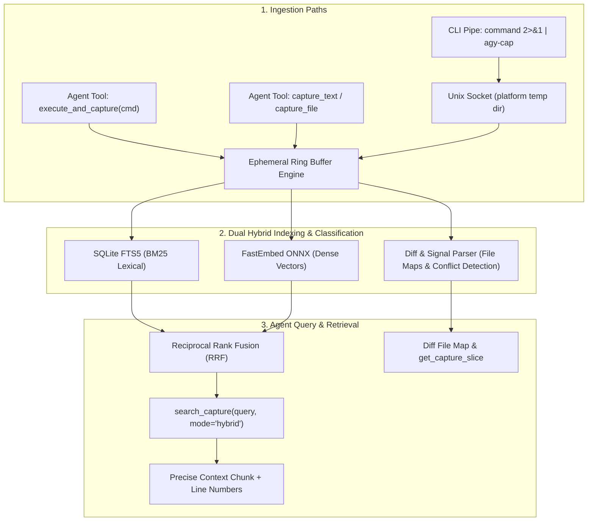

# Ephemeral Buffer MCP Server (`ephemeral-buffer`)

An ephemeral in-memory command output capture and hybrid search engine (BM25 + Semantic Embeddings) for AI coding assistants (Claude Code, Antigravity, Cursor, etc.).

---

## 🎯 The Problem This Solves

When coding agents run commands that generate large outputs (thousands of lines of build logs, test runs, stack traces, JSON dumps), agents face two failure modes:
1. **Context Pollution:** Ingesting megabytes of raw text blows out token limits and degrades model reasoning.
2. **Blind Bash Filtering:** Agents waste multiple turns running `head`, `tail`, `grep`, and `awk` trying to guess error patterns.

## 💡 The Solution

`ephemeral-buffer` provides a transient in-memory ring buffer with **Dual Hybrid Indexing** and **Content-Aware Structure Parsing**:
- **BM25 Lexical Search (SQLite FTS5):** For exact matches on error codes (`NullPointerException`, `ECONNREFUSED`, `exit 137`, HTTP `502`).
- **Dense Semantic Vector Search (FastEmbed ONNX):** For fuzzy conceptual queries (*"Where did the DB connection pool fail?"* or *"Why did authentication fail?"*).
- **Unified Diff Structural Mapping:** Automatically detects git diffs and PR diffs (`gh pr diff`, `git show`, `git diff`), parses modified files, additions/deletions, and generates a line-indexed file map in the summary.
- **Smart Signal Filtering:** Scans command/build/test logs for diagnostic keywords, suppresses false positives in diffs and source code, and accurately captures test runner failures, unhandled exceptions, and merge conflicts. Use `content_type='log'` when a plain-text capture should be signal-scanned.
- **Reciprocal Rank Fusion (RRF):** Blends lexical and semantic ranking for high precision retrieval.
- **LRU Capture Eviction:** Holds up to 25 captures and 50 MiB of captured content by default, evicting the least recently used captures when either limit is reached.
- **Thread-Safe Shared Engine:** Serializes ingestion, search, LRU updates, eviction, and cleanup across MCP requests and CLI socket clients.

---

## 🏗 Architecture & Flow



---

## 🚀 How to Use It

### 1. From the Terminal (CLI Pipe via `agy-cap`)
You can pipe command output directly into the running MCP server:

```bash
# Pipe any command output into the buffer
pytest -v 2>&1 | agy-cap --label "pytest run"

# Pipe git diffs directly
git diff HEAD~3 | agy-cap --label "feature diff" --type diff

# Or wrap command execution
agy-cap --label "backend build" -- cargo build --verbose
```

The optional `--type`/`-t` hint accepts `auto` (the default), `diff`, `log`, or
`text`. Use `diff` for unified patches when automatic detection is ambiguous;
otherwise `auto` classifies diffs, build/test logs, and plain text from the
content and label.

`agy-cap` also bounds wrapped-command and piped-stdin capture with
`--max-output-bytes`; it defaults to `EPHEMERAL_MAX_BUFFER_BYTES` or 50 MiB and
retains the beginning and end of oversized output.
Requested `max_output_bytes` and `capture_file` `max_bytes` values may not
exceed the configured buffer byte limit; the tools return a validation error
instead of silently clamping them.

### 2. From the AI Agent via MCP Tools

The agent has access to the following tools:

| Tool | Purpose |
| :--- | :--- |
| `execute_and_capture(command, cwd, label, content_type='auto', max_output_bytes=None)` | Executes a shell command with bounded head/tail capture and returns a compact diagnostic summary (exit code, diff file map, error signals, and truncation status) to the agent context. |
| `capture_text(content, label, content_type='auto')` | Ingests text directly into the buffer. |
| `capture_file(file_path, label, content_type='auto', max_bytes=None)` | Ingests a bounded log/output file from disk; defaults to the configured buffer byte limit. |
| `search_capture(query, mode, top_k, context_lines)` | Hybrid/BM25/Semantic search over the captured output. Returns matching chunks with surrounding context lines and exact line numbers. |
| `get_capture_slice(start_line, end_line)` | Retrieves exact line ranges to inspect full stack traces, logs, or specific diff files. |
| `get_capture_summary(capture_id)` | Diagnostic overview (line counts, diff file maps, error signals, preview). |
| `get_buffer_stats()` | Reports aggregate capture count, content bytes, lines, chunks, embedding bytes, accounted bytes, and process RSS. |
| `list_captures()` | Lists active captures in the ring buffer. |
| `clear_captures(capture_id)` | Clears buffer. |

For diff captures, `get_capture_summary` reports the detected file map,
addition/deletion statistics, line ranges, and merge-conflict signals. Use
`get_capture_slice` with those ranges to retrieve the complete file context.

### 3. Capture Hygiene

Keep captures focused so search results remain useful and the agent receives
only the context it needs:

- Capture one command or related output stream at a time, using a descriptive
  label.
- Start with `get_capture_summary`, then use `search_capture` or
  `get_capture_slice` for targeted retrieval instead of repeatedly recapturing
  the same output.
- Use `clear_captures(capture_id)` when a capture is no longer needed; use
  `clear_captures("all")` between unrelated investigations.

The buffer is intentionally transient and bounded by the LRU capture limit,
but explicit cleanup prevents recent investigations from obscuring the active
one before automatic eviction occurs. Its memory metrics separate captured
content and embedding bytes from process RSS; the unaccounted RSS value includes
model, index, and Python object overhead and is approximate.

The server defaults can be overridden with `EPHEMERAL_MAX_CAPTURES` and
`EPHEMERAL_MAX_BUFFER_BYTES`. Set `EPHEMERAL_SOCKET_PATH` when the default
platform temporary-directory socket is unsuitable. The byte limit accounts for
captured UTF-8 content; `get_buffer_stats` also reports embedding and process
memory separately.
`execute_and_capture` retains the beginning and end of oversized command
output and marks the capture with its original byte count.

---

## 🛠 Testing the Server

Run the test suite:
```bash
./venv/bin/python test_engine.py
./venv/bin/python -m unittest test_config.py test_capture_utils.py
./venv/bin/python -m unittest test_engine.py test_capture_utils.py test_config.py test_cli.py test_server.py
./venv/bin/python -m unittest test_e2e_pipe.py
```

Measure focused-test coverage locally:
```bash
./venv/bin/python -m pip install coverage
./venv/bin/python -m coverage run --source=. --omit='test_*.py,benchmark_concurrency.py' -m unittest test_engine.py test_capture_utils.py test_config.py test_cli.py test_server.py
./venv/bin/python -m coverage report
```
The current focused-test baseline is 82%; CI enforces an 80% minimum and uploads
the coverage reports for inspection.

GitHub Actions runs the compile check, focused tests, and end-to-end test on
Python 3.10 and 3.12 for pushes to `main` and pull requests. The FastEmbed
model cache is retained between CI runs to reduce startup time.
It also builds the wheel and verifies the installed `agy-cap` entry point.
CI audits the declared dependencies with `pip-audit` and fails if known
vulnerabilities are found.

Pushing a version tag such as `v0.1.0` runs the release workflow, which builds
wheel and source distributions, verifies the installed CLI, and uploads the
artifacts for review. The tag must match the version in `pyproject.toml`.
Publishing to PyPI is intentionally not automated.

Run the concurrency benchmark:
```bash
./venv/bin/python benchmark_concurrency.py --captures 32 --workers 8
```
