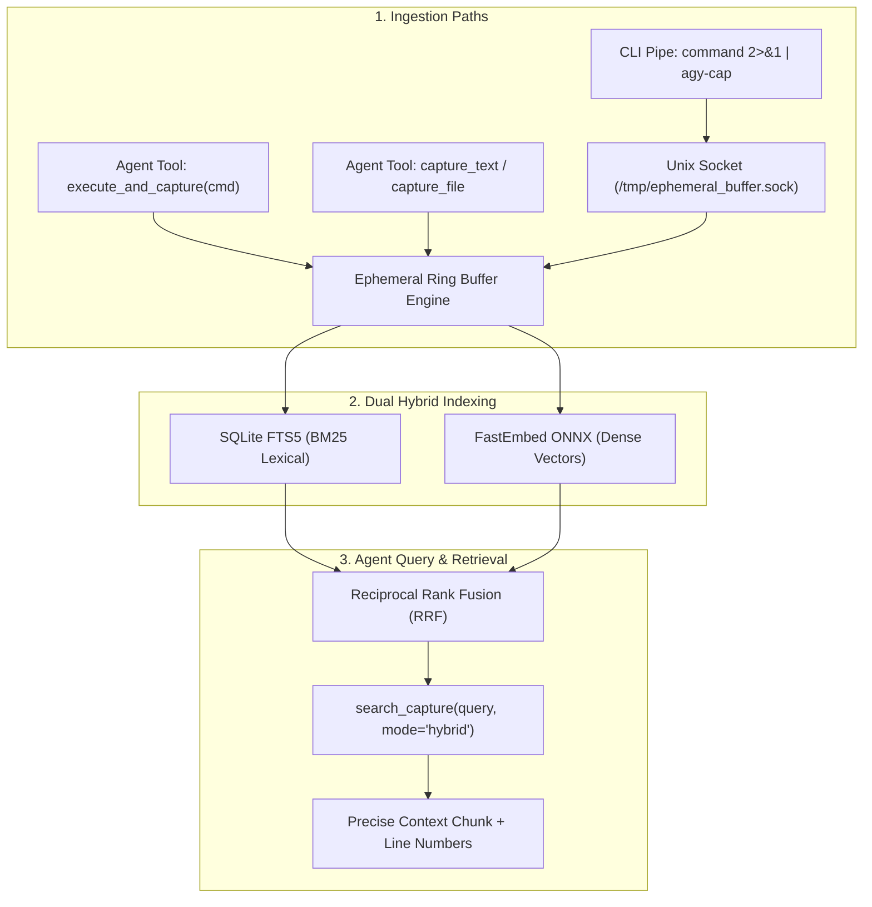

# Ephemeral Buffer MCP Server (`ephemeral-buffer`)

An ephemeral in-memory command output capture and hybrid search engine (BM25 + Semantic Embeddings) for AI coding assistants (Claude Code, Antigravity, Cursor, etc.).

---

## 🎯 The Problem This Solves

When coding agents run commands that generate large outputs (thousands of lines of build logs, test runs, stack traces, JSON dumps), agents face two failure modes:
1. **Context Pollution:** Ingesting megabytes of raw text blows out token limits and degrades model reasoning.
2. **Blind Bash Filtering:** Agents waste multiple turns running `head`, `tail`, `grep`, and `awk` trying to guess error patterns.

## 💡 The Solution

`ephemeral-buffer` provides a transient in-memory ring buffer with **Dual Hybrid Indexing**:
- **BM25 Lexical Search (SQLite FTS5):** For exact matches on error codes (`NullPointerException`, `ECONNREFUSED`, `exit 137`, HTTP `502`).
- **Dense Semantic Vector Search (FastEmbed ONNX):** For fuzzy conceptual queries (*"Where did the DB connection pool fail?"* or *"Why did authentication fail?"*).
- **Reciprocal Rank Fusion (RRF):** Blends lexical and semantic ranking for high precision retrieval.
- **Ring Buffer Eviction:** Holds only the last $N$ captures (default: 10), ensuring zero persistent storage buildup or memory leaks.

---

## 🏗 Architecture & Flow



---

## 🚀 How to Use It

### 1. From the Terminal (CLI Pipe via `agy-cap`)
You can pipe command output directly into the running MCP server:

```bash
# Pipe any command output into the buffer
pytest -v 2>&1 | agy-cap --label "pytest run"

# Or wrap command execution
agy-cap --label "backend build" -- cargo build --verbose
```

### 2. From the AI Agent via MCP Tools

The agent has access to the following tools:

| Tool | Purpose |
| :--- | :--- |
| `execute_and_capture(command, label)` | Executes a shell command, captures all output into the buffer, and returns only a compact diagnostic summary (exit code, lines, signals) to the agent context. |
| `capture_text(content, label)` | Ingests text directly into the buffer. |
| `capture_file(file_path, label)` | Ingests a log/output file from disk. |
| `search_capture(query, mode, top_k, context_lines)` | Hybrid/BM25/Semantic search over the captured output. Returns matching chunks with surrounding context lines and exact line numbers. |
| `get_capture_slice(start_line, end_line)` | Retrieves exact line ranges to inspect full stack traces or logs. |
| `get_capture_summary(capture_id)` | Diagnostic overview (line counts, error signals, head/tail preview). |
| `list_captures()` | Lists active captures in the ring buffer. |
| `clear_captures(capture_id)` | Clears buffer. |

---

## 🛠 Testing the Server

Run the test suite:
```bash
./venv/bin/python test_engine.py
```
