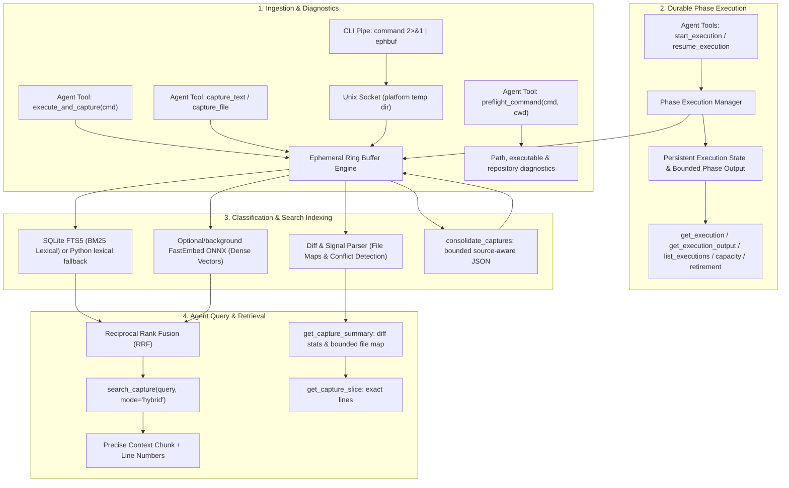

# Ephemeral Buffer MCP Server (`ephemeral-buffer`)

[](https://github.com/k-rister/ephemeral-buffer-mcp/actions/workflows/ci.yml)
[](https://github.com/k-rister/ephemeral-buffer-mcp/blob/main/LICENSE)
[](https://www.python.org/)
[](https://pypi.org/project/ephemeral-buffer-mcp/)
[](https://codecov.io/gh/k-rister/ephemeral-buffer-mcp)

An ephemeral in-memory command output capture and hybrid search engine (BM25 + Semantic Embeddings) for AI coding assistants (Claude Code, Antigravity, Cursor, etc.).

---

## 🎯 The Problem This Solves

When coding agents run commands that generate large outputs (thousands of lines of build logs, test runs, stack traces, JSON dumps), agents face two failure modes:
1. **Context Pollution:** Ingesting megabytes of raw text blows out token limits and degrades model reasoning.
2. **Blind Bash Filtering:** Agents waste multiple turns running `head`, `tail`, `grep`, and `awk` trying to guess error patterns.

## 💡 The Solution

`ephemeral-buffer` provides a transient in-memory ring buffer with **Dual Hybrid Indexing** and **Content-Aware Structure Parsing**:
- **BM25 Lexical Search (SQLite FTS5):** For exact matches on error codes (`NullPointerException`, `ECONNREFUSED`, `exit 137`, HTTP `502`). Builds without SQLite FTS5 use a complete token-based Python fallback with lower ranking performance.
- **Dense Semantic Vector Search (FastEmbed ONNX):** For fuzzy conceptual queries (*"Where did the DB connection pool fail?"* or *"Why did authentication fail?"*).
- **Unified Diff Structural Mapping:** Automatically detects git diffs and PR diffs (`gh pr diff`, `git show`, `git diff`), parses modified files, additions/deletions, and generates a line-indexed file map in the summary.
- **Smart Signal Filtering:** Scans command/build/test logs for diagnostic keywords, suppresses false positives in diffs and source code, and accurately captures test runner failures, unhandled exceptions, and merge conflicts. Use `content_type='log'` when a plain-text capture should be signal-scanned.
- Successful test-run summaries such as `OK` or `25 passed` suppress fixture-only error and failure keywords while retaining the original output for search.
- **Reciprocal Rank Fusion (RRF):** Blends lexical and semantic ranking for high precision retrieval.
- **LRU Capture Eviction:** Holds up to 25 captures and 50 MiB of captured content by default, evicting the least recently used captures when either limit is reached.
- **Thread-Safe Shared Engine:** Serializes ingestion, search, LRU updates, eviction, and cleanup across MCP requests and CLI socket clients.

---

## 📦 Installation

### Requirements

- Python 3.10 or newer
- FastMCP (the `mcp` package) 1.29.1 or newer within the 1.x series
- A supported MCP client if you want to use the server from an AI coding assistant
- Network access on first use if FastEmbed needs to download its embedding model

The package is installed from PyPI as `ephemeral-buffer-mcp`. It provides both
the MCP server and the `ephbuf` command-line client.

### Recommended: install from PyPI

Create an isolated virtual environment and install the latest published
package:

```bash
python3 -m venv .venv
.venv/bin/python -m pip install --upgrade pip
.venv/bin/python -m pip install ephemeral-buffer-mcp
```

Verify that the CLI is available:

```bash
.venv/bin/ephbuf --help
```

On Windows, use the equivalent commands from the virtual environment's
`Scripts` directory:

```powershell
py -3 -m venv .venv
.venv\Scripts\python.exe -m pip install --upgrade pip
.venv\Scripts\python.exe -m pip install ephemeral-buffer-mcp
.venv\Scripts\ephbuf.exe --help
```

To upgrade or remove the package:

```bash
.venv/bin/python -m pip install --upgrade ephemeral-buffer-mcp
.venv/bin/python -m pip uninstall ephemeral-buffer-mcp
```

### Install from a source checkout

Use an editable install when developing or testing local changes:

```bash
git clone https://github.com/k-rister/ephemeral-buffer-mcp.git
cd ephemeral-buffer-mcp
python3 -m venv .venv
.venv/bin/python -m pip install --upgrade pip
.venv/bin/python -m pip install -e .
```

The editable install exposes the same `ephbuf` command and MCP server as the
PyPI installation. The reproducible, locked contributor environment is
documented in [Testing the Server](#-testing-the-server).

When launching from a source checkout with `run.sh`, the launcher prefers
`.venv/bin/python`, then supports the legacy `venv/bin/python` layout, before
using an explicit `PYTHON` override or `python3`. An invalid `PYTHON` override
fails with an actionable error.

### Start the MCP server manually

The MCP server uses stdio for communication with the MCP host. Start it with
the Python interpreter from the environment where the package was installed:

```bash
.venv/bin/python -m server
```

Normally you should let your MCP client start this process automatically. Do
not start a separate server for every shell command: the `ephbuf` CLI sends
captures to the running server over its local Unix socket.
The private CLI socket uses versioned length-prefixed request and response
frames, so fragmented reads do not depend on half-closing the connection.

### Embed an isolated service

Python callers can create an owned service context and bind an MCP application
to it. The context owns its engine, metrics, lazy execution manager, and metrics
snapshot destination; call `close()` when the host is done with the app.

```python
from server import create_mcp_server, create_service_context

context = create_service_context(metrics_file=None)
app = create_mcp_server(context)
try:
    # Mount or run `app` with the embedding host.
    ...
finally:
    context.close()
```

`context.start()` starts optional embedding warm-up. With the default
process-private execution identity, creating a context does not create the
execution-state directory; durable execution creates it on first use. Pass a
distinct `state_dir` when contexts need separate durable namespaces. Contexts
created with `create_service_context()` keep metrics in memory by default; pass
a context-specific `metrics_file` to persist a snapshot. The standard
`python -m server` entrypoint continues to use the default context.

### Start an isolated Codex session

When using the global Codex MCP configuration, start Codex through the
installed `codex-ephemeral` launcher. From a source checkout, use
`./codex-ephemeral`. The launcher creates a unique `EPHEMERAL_SESSION_ID`
when no session ID or explicit socket path was supplied. It forwards the
session or explicit socket and state paths, along with supported EB settings,
through Codex's MCP configuration so they remain available when Codex
sanitizes the child environment.
The global configuration requires this identity, so starting Codex directly
will fail closed instead of attaching to another session's socket.

The launcher also enables `EPHEMERAL_ALLOW_STDIO_WITHOUT_SOCKET=1` because some
Codex execution environments deny Unix-socket creation. In that case MCP over
stdio remains available and runtime diagnostics report the socket failure;
`ephbuf` CLI support remains available when the environment permits socket
creation. Because the session is private, the launcher also defaults
`EPHEMERAL_METRICS=1` and passes that setting explicitly to the MCP server. Set
`EPHEMERAL_METRICS=0` before invoking the launcher to disable local metrics for
that session. The launcher also sets `EPHEMERAL_LOG_FILE` to a JSONL file
beside the session socket and defaults `EPHEMERAL_LOG_LEVEL` to `INFO`, so MCP
tool start and completion events are recorded. Set `EPHEMERAL_LOG_LEVEL` before
launching to choose another level, such as `WARNING` or `DEBUG`, or pass
`--log-level LEVEL` directly to either launcher:

```bash
./codex-ephemeral --log-level INFO
./ephemeral-agent --log-level INFO agy
```

Set `EPHEMERAL_LOG_FILE` to override the log path.

Socket and durable-state identity follow one precedence rule. An explicit
`EPHEMERAL_EXECUTION_STATE_DIR` selects the state directory. Otherwise an
explicit `EPHEMERAL_SOCKET_PATH` identifies both the socket and the derived
state directory. Without an explicit socket, `EPHEMERAL_SESSION_ID` derives
both paths. With neither identity value, EB keeps the legacy shared socket and
uses a private process state directory that is removed on normal shutdown
where secure cleanup is available. The session helper does not create an
unrelated session ID when an explicit socket path is supplied.
Use absolute paths for explicit socket and state directories in manually
configured MCP clients; the supplied shell launchers normalize them before
starting child processes.

EB parses its supported startup settings once per process. Invalid numeric and
boolean values are reported to stderr and fall back to the documented default;
empty optional values remain unset. `get_runtime_diagnostics()` includes the
effective paths, identity sources, durability mode, and a typed settings
snapshot with value, origin, validation status, and invalid-value behavior. It
reports a short session fingerprint instead of the raw session ID. The runtime
semantic-index budget permission is sampled for each adjustment request; other
settings use their startup snapshot.

### Configure other coding agents

The server is not Codex-specific. Any MCP client that launches a local stdio
server can use the same command and environment settings:

```json
{
  "mcpServers": {
    "ephemeral-buffer": {
      "command": "/absolute/path/to/ephemeral-buffer-mcp/run.sh",
      "args": [],
      "env": {
        "EPHEMERAL_REQUIRE_ISOLATION": "1",
        "EPHEMERAL_SESSION_ID": "agent-session-unique-value",
        "EPHEMERAL_ALLOW_STDIO_WITHOUT_SOCKET": "1"
      }
    }
  }
}
```

This shape applies to clients such as Claude-style `.mcp.json` and
Gemini/Antigravity-style `mcp_config.json`. Use a different
`EPHEMERAL_SESSION_ID` for every concurrent agent session. If the client
supports environment interpolation, use its per-session identifier; otherwise
generate an ID when starting the agent and place that same value in the
agent's shell environment:

```bash
export EPHEMERAL_SESSION_ID="agent-$(date +%s)-$$"
export EPHEMERAL_REQUIRE_ISOLATION=1
export EPHEMERAL_ALLOW_STDIO_WITHOUT_SOCKET=1
```

The MCP server and `ephbuf` CLI must inherit the same session ID or explicit
socket path. An MCP client that does not pass environment variables to child
processes can still use the MCP tools, but its separate `ephbuf` shell
commands will need the same identity configured independently.

For other shell-launched agents, use the installed generic launcher. From a
source checkout, use `./ephemeral-agent`:

```bash
ephemeral-agent claude
ephemeral-agent gemini
```

Or source the environment into an existing shell before launching the agent:

```bash
source ephemeral-session-env
claude   # or another coding-agent command
```

The session environment helper defaults `EPHEMERAL_METRICS=1` for the private
agent session; set `EPHEMERAL_METRICS=0` before sourcing it when metrics are not
wanted.

GUI-launched agents still need their MCP configuration to provide a unique
session ID per conversation; these scripts cannot modify an already-running
GUI process.

### Configure an MCP client

MCP clients generally need the command, arguments, and environment used to
start a stdio server. A portable configuration looks like this:

```json
{
  "mcpServers": {
    "ephemeral-buffer": {
      "command": "/absolute/path/to/ephemeral-buffer-mcp/.venv/bin/python",
      "args": ["-m", "server"]
    }
  }
}
```

Replace the command with the absolute path to the virtual-environment Python
interpreter. Using an absolute path avoids differences between GUI-launched
clients and interactive shells. On Windows, use a path such as
`C:\\path\\to\\ephemeral-buffer-mcp\\.venv\\Scripts\\python.exe`.

For clients that provide a command-line registration command, register the
same executable and arguments conceptually as:

```text
command: /absolute/path/to/.venv/bin/python
arguments: -m server
```

After saving the configuration, restart or reload the MCP client and confirm
that the `ephemeral-buffer` tools appear. The server exposes capture, search,
summary, slice, consolidation, diagnostics, and cleanup tools; the `ephbuf`
CLI is a separate convenience client for shell output.

### Isolate concurrent agent sessions

For a coding agent that may run alongside another agent, configure the same
session ID or explicit socket path for the MCP server and the `ephbuf` CLI:

```json
"env": {
  "EPHEMERAL_REQUIRE_ISOLATION": "1",
  "EPHEMERAL_SESSION_ID": "agent-session-1"
}
```

The server and CLI resolve the same socket and state identity. A missing
session ID and explicit socket path fails closed instead of falling back to
the shared legacy socket. An explicit state directory overrides derived state;
otherwise an explicit socket path derives state before a session ID does. The
MCP initialization instructions describe this policy to the client, and the
environment checks enforce isolation independently.

The CLI bounds each socket connect, send, and receive operation to 10 seconds
by default. The server uses the same setting to bound how long an admitted
client can take to send a complete request frame. Set
`EPHEMERAL_SOCKET_TIMEOUT_SECONDS` to a positive number of seconds when a
different limit is appropriate; CLI timeout failures return a nonzero result,
and stalled server-side reads return `socket_read_timeout` and release their
admission slot.

### Background model warm-up

After socket startup succeeds, the server loads FastEmbed and runs a small
deterministic embedding in a background thread. MCP startup and BM25 search do
not wait for this work. A semantic request arriving during warm-up waits on the
same model lock instead of starting a duplicate load. Subsequent operations use
the local model cache. To disable warm-up for lexical-only or memory-constrained
deployments, or to select a compatible model and cache location, set:

```bash
export EPHEMERAL_EMBEDDING_WARMUP=0
export EPHEMERAL_EMBEDDING_MODEL="BAAI/bge-small-en-v1.5-fp32"
export EPHEMERAL_FASTEMBED_CACHE_DIR="$HOME/.cache/ephemeral-buffer"
```

The default model is `BAAI/bge-small-en-v1.5-fp32`, the upstream fp32 ONNX
export of bge-small-en-v1.5 (about 130 MB), which the server registers with
FastEmbed itself. FastEmbed's own catalogue entry, selectable as
`BAAI/bge-small-en-v1.5`, is a smaller reduced-precision export that produces
identical vectors but whose matrix kernels do not parallelize on common CPU
hosts. In a release-preparation comparison on a 16-vCPU Linux x86_64 host,
the fp32 export reached 69.1 semantic chunks per second with 1.85 seconds
median indexing at 1,024 lines, versus 3.1 chunks per second and 41.15 seconds
for the catalogue file. That roughly 22x difference is host-specific evidence,
not a universal performance guarantee. Embedding inference uses ONNX Runtime's
default thread count; bound it with
`EPHEMERAL_EMBEDDING_THREADS` when the server shares a host with an
interactive coding agent, and check both settings on the deployment host with
`benchmark_semantic_index.py`. `get_buffer_stats` reports the active thread
setting.

```bash
export EPHEMERAL_EMBEDDING_THREADS=4
```

Warm-up failures do not stop the server. BM25 remains available, and hybrid
search returns lexical results with a `semantic_fallback` error-class field
when semantic initialization fails. `get_buffer_stats` and
`get_runtime_diagnostics` report warm-up as `not-started`, `loading`, `ready`,
`failed`, or `disabled`; failures expose only the exception class.

Semantic indexing uses bounded inference by default: at most 16 chunks and
4,096 padded token slots per model call. Chunks are grouped by tokenizer length,
and the retained embedding matrix is assembled incrementally. Tune these with
`EPHEMERAL_EMBEDDING_BATCH_SIZE` and
`EPHEMERAL_EMBEDDING_MAX_BATCH_TOKENS`. ONNX Runtime's CPU memory arena is
disabled by default; set `EPHEMERAL_EMBEDDING_CPU_MEM_ARENA=1` to enable it
after measuring its retained memory on your host.

Dense indexing also has a 4 MiB per-capture semantic-input budget, configurable
with `EPHEMERAL_SEMANTIC_MAX_INDEX_INPUT_BYTES`. It counts UTF-8 bytes across
semantic windows, including overlap. Above the limit, EB skips embedding
inference for that capture and returns BM25 results for semantic and hybrid
requests with `semantic_coverage: unavailable` and
`semantic_fallback: SemanticIndexBudgetExceeded`. The capture remains fully
available to lexical search and exact slices. These are inference-work bounds,
not a process RSS limit; effective values and over-budget capture counts appear
in buffer stats and runtime diagnostics.

Lexical and semantic search index different chunk grids. BM25 keeps four-line
sliding windows with two-line overlap so exact line ranges stay tight. Semantic
embeddings use separate windows packed from consecutive lines, closed at eight
lines or 1,024 UTF-8 bytes, whichever comes first, with no overlap. That keeps
every window inside the model's token limit and, because embedding cost tracks
total tokens, roughly halves the work by not embedding the overlap twice. Hybrid
ranking fuses the two grids in line space: each semantic window boosts lexical
hits whose first line it contains. If semantic windows overlap, a lexical hit
receives only the boost from the highest-ranked matching window. A semantic
window appears on its own only when no lexical hit belongs to it. Each match
reports `chunk_index` as `lexical` or `semantic` alongside its line range. Tune
the windows when output has very long or very short lines:

```bash
export EPHEMERAL_SEMANTIC_CHUNK_LINES=8
export EPHEMERAL_SEMANTIC_CHUNK_BYTES=1024
export EPHEMERAL_SEMANTIC_CHUNK_OVERLAP=0
```

Larger windows embed fewer chunks but dilute single-line signals and cost more
per token; overlap improves recall across window boundaries at proportional
embedding cost. Compare strategies on the deployment host with
`benchmark_semantic_index.py --semantic-chunk-lines ... --semantic-chunk-overlap ...`.

Semantic indexing is prefetched after ingestion by default, so a search that
arrives after the background job finishes pays no indexing cost. Disable it for
lexical-only or CPU-constrained hosts, or bound the worker pool:

```bash
export EPHEMERAL_SEMANTIC_PREFETCH=0
export EPHEMERAL_SEMANTIC_PREFETCH_WORKERS=1
```

Every eligible capture is queued at ingestion and a bounded worker pool drains
the queue newest-first, since the latest capture is the most likely search
target; a burst of captures is never silently skipped. A semantic or hybrid
search waits for a job that is already running, and pulls a still-queued
capture out of the queue to index it on a separate on-demand pool so it does
not wait behind older work. That pool is bounded by the same worker count, so
searches that give up waiting on captures that are then evicted cannot
accumulate indexing threads. Failed jobs retry through the normal lazy path,
and evicted or cleared captures drop their queued prefetch and on-demand work.
Embedding inference is serialized by one model lock, so extra workers only
overlap bookkeeping; tune `EPHEMERAL_EMBEDDING_THREADS` instead of the worker
count for throughput. `get_buffer_stats` and `get_runtime_diagnostics` expose
only aggregate pending, queued, running, and failed counts.

Indexing cost grows linearly with capture size, so a hybrid search that arrives
before a large capture's index is ready waits at most a configurable budget:

```bash
export EPHEMERAL_SEMANTIC_WAIT_SECONDS=10
```

When the budget expires, hybrid search returns the BM25 results immediately
with `semantic_coverage` set to `pending` (the tool response says
`semantic pending (lexical only)`), and indexing continues in the background
so repeating the search returns full hybrid ranking. Every other hybrid
response reports `semantic_coverage` as `complete`, or `unavailable` when the
semantic backend failed or the semantic-input budget was exceeded and
`semantic_fallback` names the exception class;
BM25 results and exact line ranges are identical either way. The default of
`10` seconds kept a 2,048-line capture fully hybrid in the
release-preparation Linux run (about 4.0 seconds to index), while 8,192- and
16,384-line captures took about 17.0 and 32.9 seconds to index and therefore
answered lexical-first within the budget. Measured first-search p95 was about
4.0 seconds at 2,048 lines (complete) and 10.002 seconds at the larger sizes
(pending); every needle in the benchmark fixture still ranked first. These
figures are host-specific: Apple silicon and other Linux hosts can differ
materially, so run `benchmark_semantic_index.py` on the deployment host before
choosing a wait budget.
Set `0` to always answer lexical-first while the index builds, or `inf` to
wait for the index unconditionally. Semantic mode has no lexical result to
fall back on, so it always waits for the index. An empty capture has nothing
to index, so it reports `complete` coverage for semantic and hybrid searches.
`get_buffer_stats` reports the budget and the number of on-demand index jobs
running and queued.

The exact model and cache location can also be supplied in the MCP client's
`env` configuration. Keep the model cache writable by the user running the
MCP client.

### Installation choices at a glance

| Use case | Recommended installation |
| :--- | :--- |
| Normal user | PyPI install in a virtual environment |
| MCP host | PyPI install, then configure the installed server command |
| Shell/CLI use | PyPI install, then run `ephbuf` |
| CLI coding agent | PyPI install, then run `ephemeral-agent` or `codex-ephemeral` |
| Contributor | Source checkout with `pip install -e .` |
| Release validation | Follow the procedures in [OPERATIONS.md](OPERATIONS.md) |

If the MCP client cannot find the server, check the absolute interpreter path,
the selected Python environment, and the client's server logs. For socket,
capture-limit, logging, and deployment troubleshooting, see
[OPERATIONS.md](OPERATIONS.md).

---

## 🏗 Architecture & Flow


```mermaid
flowchart TD
    subgraph Ingestion["1. Ingestion & Diagnostics"]
        A["CLI Pipe: command 2>&1 | ephbuf"] --> D["Unix Socket (platform temp dir)"]
        B["Agent Tool: execute_and_capture(cmd)"] --> E["Ephemeral Ring Buffer Engine"]
        C["Agent Tool: capture_text / capture_file"] --> E
        D --> E
        P["Agent Tool: preflight_command(cmd, cwd)"] --> Q["Path, executable & repository diagnostics"]
    end

    subgraph Execution["2. Durable Phase Execution"]
        X["Agent Tools: start_execution / resume_execution"] --> Y["Phase Execution Manager"]
        Y --> Z["Persistent Execution State & Bounded Phase Output"]
        Y --> E
        Z --> AA["get_execution / get_execution_output / list_executions / capacity / retirement"]
    end

    subgraph Indexing["3. Classification & Search Indexing"]
        E --> F["SQLite FTS5 (BM25 Lexical) or Python lexical fallback"]
        E --> G["Optional/background FastEmbed ONNX (Dense Vectors)"]
        E --> K["Diff & Signal Parser (File Maps & Conflict Detection)"]
        E --> M["consolidate_captures: bounded source-aware JSON"]
        M --> E
    end

    subgraph Querying["4. Agent Query & Retrieval"]
        F & G --> H["Reciprocal Rank Fusion (RRF)"]
        H --> I["search_capture(query, mode='hybrid')"]
        K --> L["get_capture_summary: diff stats & bounded file map"]
        L --> N["get_capture_slice: exact lines"]
        I --> J["Precise Context Chunk + Line Numbers"]
    end
```

---

## 🚀 How to Use It

### 1. From the Terminal (CLI Pipe via `ephbuf`)
You can pipe command output directly into the running MCP server:

```bash
# Pipe any command output into the buffer
pytest -v 2>&1 | ephbuf --label "pytest run"

# Pipe git diffs directly
git diff HEAD~3 | ephbuf --label "feature diff" --type diff

# Or wrap command execution
ephbuf --label "backend build" -- cargo build --verbose
```

The optional `--type`/`-t` hint accepts `auto` (the default), `diff`, `log`, or
`text`. Use `diff` for unified patches when automatic detection is ambiguous;
otherwise `auto` classifies diffs, build/test logs, and plain text from the
content and label.

`ephbuf` also bounds wrapped-command and piped-stdin capture with
`--max-output-bytes`; it defaults to `EPHEMERAL_MAX_BUFFER_BYTES` or 50 MiB and
retains the beginning and end of oversized output. Wrapped command output stays
on stdout, while the `ephbuf` execution banner and status messages go to stderr.
Use `--timeout-seconds` to stop a wrapped command after a bounded runtime; timed
out commands retain the output collected so far and exit with status 124.
Requested `max_output_bytes` and `capture_file` `max_bytes` values may not
exceed the configured buffer byte limit; the tools return a validation error
instead of silently clamping them.

### 2. From the AI Agent via MCP Tools

The agent has access to the following tools:

| Tool | Purpose |
| :--- | :--- |
| `execute_and_capture(command, cwd, label, content_type='auto', max_output_bytes=None, timeout_seconds=None, structured_metrics=None)` | Executes a shell command with bounded capture and returns a compact versioned JSON summary containing status, duration, sizes, approximate token counts, truncation, warnings/errors, and optional structured metrics. Cancelling or disconnecting the caller requests subprocess cleanup. |
| `preflight_command(command, cwd=None)` | Performs content-free path, symlink, local Git-root, and executable-resolution diagnostics without executing the requested command. |
| `start_execution(phases, execution_id=None, label='', resume_policy='safe', cwd=None, timeout_seconds=None, max_output_bytes=None)` | Persists and starts a sequential, durably checkpointed execution, then returns its ID and current status promptly. Use `get_execution` to follow progress. |
| `resume_execution(execution_id, retry_failed=False, confirm_unsafe=False)` | Resumes from the first incomplete phase and returns promptly; use `get_execution` to follow progress. Retries and unsafe side effects require explicit controls. |
| `cancel_execution(execution_id)` | Requests cancellation of active durable work by ID. Completed phases remain checkpointed; process cleanup uses the existing interruption and fencing path. |
| `get_execution(execution_id, include_output=False)` | Retrieves persisted phase metadata, event history, retry requirements, and human/machine-readable completion status. |
| `get_execution_output(execution_id, phase_name=None, offset=0, max_bytes=8192)` | Retrieves bounded persisted output for all phases or one phase, including after a server restart. The all-phase response shares its byte budget across phases; set `phase_name` to page through a phase with `offset`. |
| `list_executions(limit=20, offset=0)` | Lists a bounded page of durable executions and their partial/completed summaries; oversized pages return compact IDs with pagination metadata. |
| `get_execution_capacity()` | Reports durable record storage and quota diagnostics plus active and queued background execution counts; it does not attempt recovery. |
| `retire_executions(execution_ids, archive_path=None, dry_run=True)` | Previews eligibility and projected reclaimed space; actual retirement writes a private tar archive outside the state directory before removing selected record pairs. |
| `capture_text(content, label, content_type='auto', structured_metrics=None)` | Ingests text directly into the buffer and returns the same compact summary schema. |
| `capture_file(file_path, label, content_type='auto', max_bytes=None, structured_metrics=None)` | Ingests a bounded regular file from disk and returns the same compact summary schema; symlinks are followed, but pipes and devices are rejected. |
| `consolidate_captures(capture_ids, label, max_captures=25, max_bytes=None)` | Creates one bounded, searchable JSON capture from multiple captures while preserving source IDs and source line numbers. |
| `search_capture(query, mode, top_k, context_lines)` | Hybrid/BM25/Semantic search over the captured output. BM25 splits underscores and punctuation—including regex-like characters—into alphanumeric terms, then combines those terms with OR. For example, `database_connection` searches for `database` or `connection`, not one underscore-containing term. Hybrid ranking gives lexical matches priority over semantic-only matches. Returns bounded match snippets, exact numeric context boundaries, bounded raw-context previews, line numbers, and whether the match came from the lexical or semantic chunk grid. `top_k` is limited to 20 and `context_lines` to 100. The complete structured MCP result is capped at 64 KiB; use `get_capture_slice` for omitted content. Hybrid search waits at most `EPHEMERAL_SEMANTIC_WAIT_SECONDS` for a large capture's semantic index and otherwise returns lexical results marked `semantic pending`; repeat the search for hybrid ranking. Captures beyond the semantic-input budget return BM25 results with semantic coverage `unavailable`. |
| `get_capture_slice(start_line, end_line, capture_id='latest', max_bytes=65536, cursor=None)` | Retrieves one byte-bounded page from a 1-indexed line range. A long line can continue across pages; repeat the original range and pass back `next_cursor` until it is null. `max_bytes` bounds the serialized MCP result and must be between 4 KiB and 64 KiB. The cursor is opaque; each segment reports a zero-based UTF-8 byte offset within its line, and pages never split a Unicode character. Joining `structuredContent.data.content` from successive pages reconstructs the retained newline-joined text exactly. |
| `get_capture_summary(capture_id, include_previews=False)` | Returns the compact JSON summary; opt into bounded head/tail previews only when needed. |
| `get_buffer_stats()` | Reports aggregate capture count, content bytes, lines, chunks, embedding model readiness, embedding bytes, semantic memory limits, accounted bytes, and process RSS. When local metrics are enabled, it also includes the content-free metrics snapshot for the active MCP session (or the aggregate process scope for direct calls). |
| `get_runtime_diagnostics()` | Opt-in, content-free report of runtime version, platform, uptime, socket and durable-state identity, durability, startup setting values and origins, active log file and level, buffer limits, embedding readiness, and process memory. |
| `get_usage_metrics(since=None)` | Returns a versioned, content-free JSON snapshot of local usage metrics, including interface coverage, per-tool counters, workflow events, byte counters, and scope- or task-window measurement timestamps. Pass a prior `snapshot_token` as `since` for a task-window delta. |
| `set_semantic_index_budget(max_indexed_chunks)` | Adjusts the session's semantic-index chunk budget when `EPHEMERAL_ALLOW_RUNTIME_INDEX_BUDGET=1`; decreases evict least-recently-used captures as needed. |
| `list_captures()` | Lists active captures in the ring buffer. |
| `clear_captures(capture_id)` | Clears buffer. |

Capture tools return a compact JSON summary so an agent can decide whether it
needs the full output before spending context on retrieval. The summary uses
`schema_version: 1` and includes `status` (`captured`, `success`, `failed`, or
`timed_out`), `duration_ms`, retained and original byte sizes, approximate
token counts, truncation and partial-execution flags, typed warning/error
signals, and bounded caller-provided `structured_metrics`. The token values
are deterministic planning estimates based on four UTF-8 bytes per token;
they are not provider billing counts. Use `get_capture_summary` for the
compact form, set `include_previews=True` only when a head/tail sample is
useful, and use `get_capture_slice` or `search_capture` for complete or
targeted content. Diff file maps are also bounded and report omitted entries;
use `get_capture_slice` for the complete diff. Raw retained captures are
unchanged by summary generation.

Capture, search, retrieval, and clear tools return a versioned MCP result
envelope with `schema_version`, `status`, `data`, optional `error` (`code` and
`message`), and truncation or continuation metadata. MCP clients continue to
receive readable text in `content[0].text`; the same result data is also
available in `structuredContent`. The envelope's `status` is `ok` or `error`.
Stable retrieval and search error codes include `capture_not_found`,
`invalid_range`, `invalid_cursor`, `invalid_byte_budget`,
`response_budget_too_small`, `invalid_query`, `query_too_large`, and
`unsupported_search_mode`.

The Python text helpers `search_capture` and `get_capture_slice` retain their
string return values. Python callers that need the structured form can use
`search_capture_result` and `get_capture_slice_result`; these return the same
typed envelope and readable `.text` value. For retrieval, concatenate each
page's `data["content"]` value to reconstruct the retained content. Cursor
offsets count UTF-8 bytes from the start of the current line; treat the cursor
itself as opaque and pass it back unchanged.

Python engine callers receive a frozen `CaptureView` from `ingest`,
`get_capture`, and `get_capture_view`. The historical `get_capture` method
remains as a compatibility wrapper; these views expose supported metadata but
not raw lines, chunks, embeddings, SQLite connections, or reader state. Retrieve
content through the bounded slice and search APIs. Semantic benchmarks should
use `load_embedding_model`, `index_capture`, `wait_for_capture_index`, and
`get_capture_diagnostics`; the underscored model and indexing methods are
engine internals.

The deterministic summary benchmark measures the initial agent-prompt
reduction for representative successful, failed, noisy, truncated, and
timed-out captures. It exercises the public capture API, compares a
parent-contract formatted-text response with the current compact
summary-first decision prompt, and verifies through the public slice API that
retained output can still be retrieved unchanged. The parent response is
reconstructed from the prior `execute_and_capture` contract; the current path
uses the public compact response. The proxy divides UTF-8 prompt bytes by four
and is intended for regression comparison, not provider billing or exact
token accounting. Execution summaries also bound command and label metadata
so unusually long shell commands cannot re-expand the initial response.

To generate the machine-readable benchmark record:

```bash
.venv/bin/python benchmark_effectiveness.py --summary --output /tmp/capture-summary.json
```

Choose the execution path based on the output and inspection goal:

- Use direct command execution for a small, targeted inspection where the
  output is already bounded and immediate terminal feedback is sufficient.
- Use `execute_and_capture` once output may be noisy, large, or uncertain—such
  as tests, builds, and logs—because it bounds context and makes later search
  and exact retrieval available. This is an advisory heuristic, not a hard
  line-count policy.
- Use `capture_text` when output is already in hand, or `capture_file` for a
  file that has been checked and intentionally selected for ingestion.

Use `preflight_command` when repository identity or path resolution is
uncertain before a sensitive command. It reports resolved facts and explicit
unavailable states without running the requested command or exposing command
output. It cannot predict shell expansion, aliases, pipelines, redirections,
environment changes, or arbitrary shell logic, so normal command validation
and user intent checks remain necessary.

### Resumable phase execution

Durable phase execution and its process-group recovery currently require Linux
with file-locking support and `/proc` process identities. The package's
Windows installations remain usable for MCP stdio and text/file capture.
Bounded subprocess capture requires POSIX pipe and process-group support, and
`start_execution` additionally requires Linux leases, `/proc` process
identities, pidfd signaling, and selector support; startup rejects the request
with a clear platform error when those recovery backends are unavailable.

Use `start_execution` when a long-running workflow has meaningful checkpoints:

```text
start_execution(
  execution_id="release-checks",
  phases=[
    {"name": "tests", "command": "python -m unittest", "timeout_seconds": 900},
    {"name": "publish", "command": "./publish.sh", "side_effects": "unsafe"},
  ],
)
```

`start_execution` returns the durable execution ID and current status without
waiting for all phases to finish. Use `get_execution` and
`get_execution_output` to follow it. Disconnecting from the MCP request only
detaches the caller; call `cancel_execution(execution_id)` to request
termination. Cancellation records the current phase as `interrupted`, keeps
completed checkpoints, and fences the subprocess if cleanup cannot be
confirmed. `resume_execution` also returns promptly after scheduling work.
The manager accepts up to eight active or queued background executions;
`get_execution_capacity` reports the current counts. If a background task
fails outside normal phase handling, `get_execution` reports a
`background_error` with the recorded execution state.

Each phase is persisted as `pending`, `started`, `completed`, `failed`,
`interrupted`, or `timed_out`. Output, exit status, duration, truncation, and
caller metrics are written after every finished phase. If the server restarts
while a phase is `started`, the next inspection records it as `interrupted`.
`resume_execution` skips every completed phase and continues at the first
incomplete phase. Failed and timed-out phases require `retry_failed=True`;
safe phases recovered as `interrupted` resume automatically. A timed-out phase
whose process-group cleanup is not confirmed remains fence-pending and blocks
retry. An interrupted
phase marked `side_effects: "unsafe"` additionally requires
`confirm_unsafe=True` unless the execution was created with the explicit
`resume_policy="allow-unsafe"`. The persisted `idempotency_key` is
an audit boundary for an external operation; it does not replace confirmation
or provide an external deduplication guarantee. The compatibility alias
`unsafe_side_effects: true` is normalized to `side_effects: "unsafe"`; if both
fields are supplied, they must agree.
The command is run beneath a Linux subreaper supervisor that adopts and
terminates descendants which escape the original process group. The supervisor
identity and a durable phase launch marker are checkpointed while a phase runs.
During restart recovery, the supervisor is signalled through a pidfd, then the
remaining processes carrying that phase marker are found and terminated before
the original process group is checked for absence. Resume stays blocked if
identity lookup, marker scanning, supervisor termination, descendant cleanup,
or group absence cannot be confirmed. Linux process start and boot identities
are revalidated while the pidfd is pinned, protecting recovery from signalling
a reused process ID. A phase marks its launch fence before spawning the
command, so a crash before process identity is persisted also fails closed.
An unreadable process environment makes the marker scan inconclusive and keeps
recovery blocked, including when the process belongs to another user.
Older in-progress records without these identity fields are recovered as
fence-pending and must be inspected or retired rather than being retried
automatically.

Execution responses include a human-readable `summary`, machine-readable
`execution_status` and `partial` fields, per-phase event history, and the
next resumable phase. If detailed metadata would exceed the 64 KiB tool
response budget, the server returns a compact response with the durable
`execution_id` and `response_truncated: true`; call `get_execution` or the
bounded output tool to retrieve details. Durable JSON state defaults to a
temporary local process-private directory created securely with owner-only
permissions. An explicit `EPHEMERAL_EXECUTION_STATE_DIR` takes precedence for
storage; otherwise an explicit `EPHEMERAL_SOCKET_PATH` identifies the derived
state directory, followed by `EPHEMERAL_SESSION_ID` when no socket path is
explicit. Identity-derived state is retained across normal server shutdowns;
the private process directory is removed on normal shutdown where secure
cleanup is available. State contains commands and bounded output, so protect
explicitly configured directories when those contents are sensitive.

When both an explicit socket and session ID are set, the socket path now
selects the derived state namespace. If an existing session-derived directory
is detected, startup reports its location. Set
`EPHEMERAL_EXECUTION_STATE_DIR` to that exact directory to continue using its
records. EB never moves state automatically.

Execution metadata is bounded to 64 MiB per record, 64 phases, 32 attempts per
phase, 16 KiB of structured metrics, and 1,000 records per state directory;
list results are paginated with a maximum page size of 100. The aggregate state
quota defaults to 4 GiB (`EPHEMERAL_EXECUTION_STATE_QUOTA_BYTES`) with a 128 MiB
checkpoint reserve (`EPHEMERAL_EXECUTION_CHECKPOINT_RESERVE_BYTES`). The reserve
must be at least the per-record limit and smaller than the aggregate quota;
servers sharing a state directory must use the same values.
Record and summary JSON bytes, atomic-write temporary files (including crash
leftovers), and active phase reservations use the quota;
the configured reserve is excluded from committed data and provides allowance
for atomic checkpoint writes. Before a phase starts, the server checks current
filesystem free space for the bounded checkpoint reservation plus that reserve.
Other processes can still consume filesystem space after this check. There is no
automatic expiry. Use `get_execution_capacity()` to inspect usage, then call
`retire_executions(execution_ids)` to preview which records can be retired and
how many bytes their record/summary pairs occupy. Actual retirement requires
`dry_run=False` and a new `archive_path` outside the state directory. Active,
started, or fence-pending records are refused. State records and execution
leases use the same namespace precedence documented above: explicit state
directory, explicit socket path, then session ID. Without an identity, each
server process receives a fresh private state directory that is removed during
normal shutdown on POSIX platforms. Windows may retain that temporary
directory because secure owner-identity cleanup is not available there.

Before any repository-sensitive command or file capture, verify the intended
working directory and target path. Prefer an explicit `cwd`, confirm the
repository identity, and resolve symlinks when path identity matters. Shell
expansion, inherited working directories, and symlinks can target a different
location than the spelling suggests. Capture limits protect context size; they
do not validate command intent, path identity, or filesystem safety.

For diff captures, `get_capture_summary` reports the detected file map,
addition/deletion statistics, line ranges, and merge-conflict signals. Use
`get_capture_slice` with those ranges to retrieve the complete file context.

### Consolidating multi-result workflows

When a workflow produces several captures—for example, one command per
repository—use `consolidate_captures` to give the agent one bounded overview:

```text
consolidate_captures(
  capture_ids=["cap_1", "cap_2", "cap_3"],
  label="organization activity",
  max_captures=25,
  max_bytes=20000
)
```

The resulting capture is JSON with source metadata and records containing the
original `capture_id` and `source_line`. It can be searched normally with
`search_capture`, and exact consolidated context can be retrieved with
`get_capture_slice`. The response reports omitted records, missing IDs, and
the original source IDs; use those original IDs to retrieve complete detail
when the consolidated byte budget is reached. Calling the tool without
`capture_ids` consolidates the currently active captures, up to
`max_captures`.

This workflow keeps the server responsible for bounded execution, storage, and
retrieval while leaving prioritization and interpretation to the coding agent.

### 3. Capture Hygiene

Keep captures focused so search results remain useful and the agent receives
only the context it needs:

- Capture one command or related output stream at a time, using a descriptive
  label.
- Start with `get_capture_summary`, then use `search_capture` or
  `get_capture_slice` for targeted retrieval instead of repeatedly recapturing
  the same output.
- Use `clear_captures(capture_id)` when a capture is no longer needed; use
  `clear_captures("all")` between unrelated investigations.

The buffer is intentionally transient and bounded by the LRU capture limit,
but explicit cleanup prevents recent investigations from obscuring the active
one before automatic eviction occurs. Its memory metrics separate captured
content and embedding bytes from process RSS; the unaccounted RSS value includes
model, index, and Python object overhead and is approximate.

The server defaults can be overridden with `EPHEMERAL_MAX_CAPTURES` and
`EPHEMERAL_MAX_BUFFER_BYTES`. Session-aware launchers can set
`EPHEMERAL_SESSION_ID` so each server/CLI pair automatically derives a unique
socket path; `EPHEMERAL_SOCKET_PATH` remains an explicit override. The byte
limit accounts for captured UTF-8 content plus its label; a capture is rejected
when their combined size exceeds the limit. `get_buffer_stats` also reports
embedding model readiness, embedding/cache settings, and process memory
separately.

Foreground MCP work and CLI socket clients have bounded active and queued
capacity. Defaults are 8 active and 16 queued MCP calls, plus 4 active and 8
queued socket clients. When a lane is full, the server returns a `server_busy`
error that can be retried. Configure these limits with
`EPHEMERAL_MAX_ACTIVE_TOOL_WORK`, `EPHEMERAL_MAX_QUEUED_TOOL_WORK`,
`EPHEMERAL_MAX_ACTIVE_SOCKET_CLIENTS`, and
`EPHEMERAL_MAX_QUEUED_SOCKET_CLIENTS`. `get_buffer_stats` reports active,
queued, and rejected work and reader-pinned storage that remains after capture
eviction, and has a reserved worker slot so it remains available under load.
The CLI can receive a busy response while uploading a large socket frame. These
concurrency limits make foreground work predictable; they do not cap process
RSS.

Shutdown stops admitting new work, requests cancellation of active command and
durable execution work, and drains for at most
`EPHEMERAL_SHUTDOWN_GRACE_SECONDS` (default `10`). If work remains, the
shutdown report and structured log identify unfinished work by type and
execution count. Each service context waits only for its own admitted calls;
work owned by another context in the same process does not hold up its cleanup.
Native embedding inference already running in a thread cannot
be forcibly stopped by cancelling its await; it is reported as unfinished and
may outlive the grace period. Python may keep the process alive until that
worker returns.

Indexed chunks are bounded separately by `EPHEMERAL_MAX_INDEXED_CHUNKS`, which
defaults to 32,768 total chunks across retained captures. LRU eviction makes
room for a new capture when possible. A capture that exceeds the entire index
budget is rejected rather than partially indexed, so accepted captures remain
fully searchable and cannot produce silent semantic false negatives. The
optional `set_semantic_index_budget` tool changes this limit for the current
session only and is disabled unless `EPHEMERAL_ALLOW_RUNTIME_INDEX_BUDGET=1` is
set at startup. Decreases use the same deterministic LRU order and may evict
multiple captures; deployment defaults are not changed or persisted.
`execute_and_capture` retains the beginning and end of oversized command
output and marks the capture with its original byte count. Each returned head
or tail preview is independently capped at 4 KiB of UTF-8 data; a truncation
marker directs the agent to `get_capture_slice` for the complete content.

Call `get_runtime_diagnostics()` when reporting a field observation. It is
explicitly opt-in and returns operational metadata only; captured content,
labels, command arguments, and session ID values are excluded. Sanitize any
additional output before sharing it.

Operational events are written as privacy-safe JSON lines to stderr and, when
`EPHEMERAL_LOG_FILE` is set, to that file. Direct server launches default to
warnings and errors; the session launchers default to `INFO` and put the log
beside the session socket. Log files use owner-only `0600` permissions, and
symlink paths are rejected. If file logging cannot be opened safely, events
remain available on stderr and runtime diagnostics report the file as
unavailable. Tool lifecycle events contain only a local call ID, tool name,
duration, success state, and error class. Logs never include captured content,
labels, query text, or command text. A start event without a matching
completion or failure event identifies a stalled tool/session boundary.
The Codex A/B adapter can persist these events per MCP run with
`--diagnostic-log-dir /path/to/logs`; keep that directory outside the
repository. The files contain lifecycle metadata only.

### Optional local usage metrics

Set `EPHEMERAL_METRICS=1` to collect content-free, in-process usage metrics.
The isolated coding-agent launchers enable this setting by default; direct
server launches remain opt-in.
The metrics include per-tool call counts, success/failure counts, duration
totals, capture/search/retrieval, empty-search, eviction, and cleanup events,
plus interface coverage showing how many of the 19 exposed MCP tools were
called and the complete list of unused tools. MCP snapshots are scoped to the
active transport session and include a server-generated opaque
`attribution.id`; the persisted metrics file remains an aggregate process
snapshot. Interface coverage also reports descriptive coverage by primary
capability category; it is not a mandate for a client to use every category or
tool. The categories are:

| Category | Exposed tools |
| :--- | :--- |
| `capture` | `capture_text`, `capture_file`, `execute_and_capture`, `consolidate_captures` |
| `configuration` | `set_semantic_index_budget` |
| `diagnostics` | `preflight_command`, `get_buffer_stats`, `get_runtime_diagnostics`, `get_usage_metrics` |
| `execution` | `start_execution`, `resume_execution`, `cancel_execution`, `get_execution`, `get_execution_output`, `list_executions`, `get_execution_capacity`, `retire_executions` |
| `lifecycle` | `clear_captures` |
| `retrieval` | `get_capture_slice`, `get_capture_summary`, `list_captures` |
| `search` | `search_capture` |

They also include session-scoped data-path byte counters. The byte counters
cover input, retained, and original capture bytes; tool/search/retrieval
response bytes; and framed socket request/response bytes. They are disabled by
default, are never sent anywhere, and do
not retain captured content, labels, commands, or query text. When enabled,
`get_usage_metrics()` returns the versioned JSON form directly. Each enabled
response includes a `snapshot_token`; pass that token as `since` on a later
call to obtain a non-resetting task-window delta. A valid window reports
`window.status` as `ok`, including when all activity counters are zero. An
invalid, expired, or pre-restart token reports `window.status` as
`unavailable` instead of being interpreted as zero activity. Tokens are local
to the active metrics scope and bounded in-memory token history; a new
isolated coding-agent session always starts a new measurement scope. MCP
requests are additionally scoped to their transport session: the response
reports `scope: "mcp_session"` and an opaque `attribution.id`, and coverage,
funnel, byte, and per-tool counters are isolated between clients sharing one
server process. The ID is generated by the server and never contains the
configured session ID or socket path. Direct, unbound calls and the persisted
`EPHEMERAL_METRICS_FILE` snapshot use `scope: "process"` as the aggregate
fallback. Both `get_runtime_diagnostics()` and `get_buffer_stats()` include
the metrics snapshot for their active scope. Coverage uses the live MCP
registration inventory, so its available-tool count tracks the exposed API.
To keep long-running shared servers bounded, at most 128 process/client scope
states are retained; an inactive session whose state is evicted starts a fresh
metrics window if it later returns.
The `workflow_effectiveness` section derives operational signals from the
same process or task-window state. Funnel rates use explicit operation
denominators: capture-to-search uses `searches`, search-to-retrieval uses
`retrievals`, empty-search uses `searches`, and successful-call uses completed
calls (`successes + failures`). Response-byte ratios and reductions use
`capture_input_bytes` as the captured-byte baseline and require at least one
corresponding search or retrieval operation. A zero denominator or absent
operation is reported as `status: "unavailable"` with a null value. These
signals describe workflow behavior and response volume; they do not measure
answer quality or require clients to use every tool.
Each per-tool record also includes a bounded `latency_ms` distribution with
the call count and nearest-rank `p50`, `p95`, and `p99` estimates. The fixed
histogram uses millisecond upper-bound buckets from 1 ms through 60 seconds
plus an overflow bucket; a percentile whose rank lands in the overflow bucket
is reported as `null`, alongside `overflow_count`. Latency distributions are
additive in task-window deltas. Failed calls include zero-filled,
content-free `failure_categories` for `validation`, `timeout`, `socket`,
`embedding`, `eviction`, and `other`. These categories contain no exception
messages, commands, paths, queries, or capture identifiers.
Schema-invalid MCP arguments are measured at the FastMCP validation boundary
as failed calls in the `validation` category, even when the tool function does
not run. If the installed SDK does not support that instrumentation, normal
SDK validation and tool dispatch continue; `get_runtime_diagnostics` reports
which tools lack validation metrics.
The `semantic_index` section reports content-free indexing operations separately
for `prefetch` and `on_demand`. Each source includes queued, completed, failed,
cancelled, evicted, and cleared job counts; indexed chunk totals; and bounded
`queue_wait_ms` and `indexing_duration_ms` distributions. The `search` subsection
counts hybrid responses that were pending and semantic searches that fell back
to lexical results. Queue wait ends when embedding begins, while indexing
duration ends when the job publishes or fails, so host waiting and embedding
work remain distinguishable. `throughput` derives indexed chunks per indexing
second and reports an explicit unavailable status when its denominator is zero.
These counters are additive in task-window deltas and contain no capture
identifiers or content.
The event keys are stable
and zero-filled when no event has occurred, as are the byte-counter keys. Wire counts include framing
headers and payload bytes actually consumed, including partial malformed
requests; payload bytes rejected from an oversized frame before reading are
not counted. MCP tool-response counts measure UTF-8 response content and
exclude transport-envelope overhead. Metrics are scope-lifetime state:
restarting the server clears them, while capture-associated correlation state
is released when a capture is evicted or explicitly cleared. The process scope
is aggregate; MCP transport sessions use separate scopes.

### Effectiveness metrics and privacy

The built-in metrics are local operational telemetry. Direct server launches
are opt-in, while isolated coding-agent launchers enable them by default.
Nothing is uploaded or shared by the server. The metrics contain
counts, durations, byte sizes, and bounded lifecycle outcomes, but do not
retain captured content, labels, command arguments, or query text. Runtime
logs follow the same privacy model. Treat any captured output or diagnostic
excerpt as potentially sensitive and sanitize it before sharing.

Interpret the measurements in two separate layers:

| Layer | What it answers | What it cannot establish |
| :--- | :--- | :--- |
| Operational health | Did the server accept, store, search, retrieve, evict, and clean up requests? Were calls successful and how much local time or memory did they use? | That a search result was relevant, that the agent saw the right context, or that the user's task was completed. |
| Task-level effectiveness | Did a representative agent workflow find the needed signal, retrieve the right context, and complete its task? | A universal result from synthetic fixtures or a server-only benchmark. |

The effectiveness harness measures server-side behavior with deterministic
fixtures and does not invoke a coding-agent model. A successful targeted
retrieval means only that the fixture's expected marker was found. It is not a
measure of answer quality, search relevance in a real repository, token cost,
or end-to-end task completion. Use representative, privacy-reviewed tasks for
those questions and report the fixture, seed, repetition count, success rate,
useful-search rate, byte measurements, and local timing separately.

For a reproducible local diagnostic, start the server with
`EPHEMERAL_METRICS=1`, exercise the workflow, then request
`get_runtime_diagnostics()` and `get_buffer_stats()`. A safe bug report
includes the version/commit, Python/platform, configuration limits, operation
name, reproduction steps, and sanitized metric output; it excludes captures,
credentials, tokens, private paths, source code, user data, and raw queries.

See [OPERATIONS.md](OPERATIONS.md) for deployment settings, troubleshooting,
release verification, and repository maintenance procedures.

---

## 🛠 Testing the Server

Set up a local development environment from a fresh checkout:

```bash
python3.12 -m venv .venv
.venv/bin/python -m pip install --require-hashes -r requirements-dev-lock-py312.txt
```

The committed `requirements-dev-lock-py312.txt` file is the reproducible
Python 3.12 development and release environment. Python 3.10 remains
supported through the direct requirements and tested `constraints.txt` file;
the CI matrix exercises both paths. Keep `requirements.txt` and
`requirements-dev.txt` as the reviewable dependency inputs, and regenerate the
Python 3.12 locks with `pip-tools` after an intentional dependency update:

```bash
.venv/bin/python -m pip install pip-tools
.venv/bin/pip-compile --generate-hashes --output-file=requirements-lock-py312.txt requirements.txt
.venv/bin/pip-compile --generate-hashes --output-file=requirements-dev-lock-py312.txt requirements-dev.txt
```

Review the resulting changes, run the full test matrix, and run `pip-audit`
before merging. Downstream users install the package normally; its compatible
dependency ranges in `pyproject.toml` are intentionally not replaced by the
development locks.

Run local tests through `scripts/with-test-env.sh`. It replaces inherited
session, socket, execution-state, metrics, and log paths with one private
temporary namespace, enables required socket isolation, and passes those
settings to test subprocesses. The temporary paths are removed when the command
exits, so tests run safely from a shell that also belongs to an active EB
session.

Run the test suite:
```bash
EPHEMERAL_TEST_EMBEDDINGS=1 ./scripts/with-test-env.sh .venv/bin/python -m unittest test_benchmark_warmup.py test_benchmark_semantic_memory.py test_engine.py test_capture_utils.py test_config.py test_cli.py test_server.py test_execution.py test_execution_server.py
EPHEMERAL_TEST_EMBEDDINGS=1 ./scripts/with-test-env.sh .venv/bin/python -m unittest test_e2e_pipe.py
```

Measure focused-test coverage locally:
```bash
EPHEMERAL_TEST_EMBEDDINGS=1 ./scripts/with-test-env.sh .venv/bin/python -m coverage run --source=. --omit='test_*.py,setup.py,benchmark_concurrency.py,benchmark_effectiveness.py,benchmark_latency.py,benchmark_warmup.py,benchmark_agent_ab_repository_fixture.py,release_checks.py' -m unittest test_benchmark_concurrency.py test_benchmark_effectiveness.py test_benchmark_warmup.py test_benchmark_semantic_memory.py test_release_checks.py test_benchmark_agent_ab_repository_fixture.py test_engine.py test_capture_utils.py test_config.py test_cli.py test_server.py test_execution.py test_execution_server.py
.venv/bin/python -m coverage report
```
CI requires 100% coverage for application runtime modules and excludes test,
benchmark, release-check, and packaging-metadata files from that gate. Coverage
reports are uploaded for inspection, and new runtime paths should include
targeted tests.
The release guardrail utility is measured separately because it is a workflow
utility rather than application runtime code:
```bash
COVERAGE_FILE=.coverage.release EPHEMERAL_TEST_EMBEDDINGS=1 ./scripts/with-test-env.sh .venv/bin/python -m coverage run --source=. -m unittest test_release_checks.py
COVERAGE_FILE=.coverage.release .venv/bin/python -m coverage report --include='release_checks.py'
```

GitHub Actions runs the compile check, focused tests, and end-to-end test on
Python 3.10 and 3.12 for pushes to `main` and pull requests. A compatibility
matrix also checks FastMCP 1.29.1 and the latest 1.x release. The FastEmbed
model is loaded on the first capture or semantic search rather than during
server import. Set `EPHEMERAL_EMBEDDING_MODEL` to select a compatible model and
`EPHEMERAL_FASTEMBED_CACHE_DIR` to control its cache directory. The model cache
is retained between CI runs to reduce startup time. CI unit and end-to-end
tests set the internal `EPHEMERAL_TEST_EMBEDDINGS=1` flag, which uses a small
deterministic embedding substitute so test execution does not depend on a
model download; release and benchmark jobs continue to exercise FastEmbed.
It also builds the wheel and verifies the installed `ephbuf` entry point.
CI audits the declared dependencies with `pip-audit` and fails if known
vulnerabilities are found.
CI installs the hashed Python 3.12 development/runtime locks and uses the
tested `constraints.txt` path for Python 3.10. The direct requirements and
constraints are updated only after the full test matrix passes; lock updates
must be reviewed together with their resolver output and audit results.

Pushing a version tag such as `v0.1.1` runs the release workflow, which first
verifies that the tag is valid SemVer, points to a commit contained in the
default branch, and starts from a clean checkout. It also requires the tag,
`pyproject.toml`, and a dated matching `CHANGELOG.md` section to agree. The
workflow then builds wheel and source distributions, validates their metadata,
verifies the installed package, and uploads the artifacts for review. A failed
guardrail reports the mismatched value or source-state problem before building.
The workflow creates a GitHub Release using the matching changelog section,
attaches the wheel, source distribution, and `SHA256SUMS`, and links back to
the workflow run containing the build-provenance attestation. Verify a
downloaded artifact with `sha256sum --check SHA256SUMS` from the directory
containing the files. The same verified distributions are then published to
PyPI through trusted publishing.
After the repository's `pypi` environment is configured with a PyPI trusted
publisher, the workflow publishes the distributions to PyPI automatically.

Run the concurrency benchmark:
```bash
.venv/bin/python benchmark_concurrency.py --captures 32 --workers 8
```
The benchmark accepts `--min-ingest-per-second` and `--min-reads-per-second`
thresholds for direct checks. For repeatable regression checks, pass
`--baseline benchmark_baseline.json --output benchmark-concurrency.json`.
The checked-in baseline uses a 20% tolerance: a run fails only when ingest or
read throughput drops below 80% of its baseline. Each scheduled or manually
dispatched GitHub Actions run records the raw JSON result as an artifact and
adds the measurements and regression status to the workflow summary. This
benchmark remains optional and is not part of the required pull-request checks;
update the baseline deliberately when the runner or benchmark workload changes.

Measure command-capture latency by output size and pipeline phase:
```bash
EPHEMERAL_TEST_EMBEDDINGS=1 .venv/bin/python benchmark_latency.py \
  --samples 5 --output benchmark-latency.json
```
The latency harness reports cold-start time plus warm median and p95 timings
for command execution, BM25 capture/indexing, deferred semantic indexing,
summary generation, and the combined pipeline. Semantic embeddings are now
materialized when semantic or hybrid search first needs them, so the warmup
explicitly materializes the warm engine's embeddings before timed samples begin.
Use the separate semantic-index phase when evaluating end-to-end costs; cold
start includes the first engine's model and embedding setup, while warm samples
reuse the configured model cache and engine. The benchmark is diagnostic and
optional, not a required pull-request check.

Compare lazy semantic indexing with the default asynchronous prefetch:
```bash
EPHEMERAL_TEST_EMBEDDINGS=1 .venv/bin/python benchmark_prefetch.py \
  --line-count 256 --samples 5 --output benchmark-prefetch.json
```
The prefetch harness reports ingestion, first semantic search, and subsequent
semantic search medians for both modes. Prefetch can reduce first-query latency
when work completes during ingestion, while adding bounded background resource
use. In the release-preparation 256-line Linux run, first-search median changed
from 0.435 seconds without prefetch to 0.425 seconds with it, while ingestion
changed from 1.19 ms to 1.63 ms; treat this as deployment-specific diagnostic
evidence rather than a guaranteed improvement.

Measure semantic indexing cost and first hybrid-search latency by capture size:
```bash
.venv/bin/python benchmark_semantic_index.py \
  --samples 3 --output benchmark-semantic-index.json
```
The semantic-index harness ingests a fresh deterministic log-like capture per
sample, then reports median and p95 timings for ingestion, lazy embedding
materialization, the first hybrid (or `--mode semantic`) search that triggers
it, and a subsequent search over the complete index, plus chunk count and
indexing throughput. The first search runs against the semantic wait budget
(`--semantic-wait-seconds`, default `EPHEMERAL_SEMANTIC_WAIT_SECONDS` or 10),
so the report shows how often it answered with pending semantic coverage
(`first_search_pending_rate`) and the needle rank it achieved
(`first_search_needle_mrr`) next to the rank over the complete index
(`needle_mrr`); pass `--semantic-wait-seconds inf` to time the full lazy
indexing cost inside the first search instead. Default sizes are 16, 256,
2,048, and 8,192 lines. Run it without `EPHEMERAL_TEST_EMBEDDINGS=1` to measure
the configured FastEmbed model; with deterministic test embeddings it only
validates the harness. Prefetch and startup warm-up are disabled inside the
harness so the lazy cost is visible. Results are host-specific diagnostic
evidence, not a required CI gate.

A five-sample release comparison on Linux with Python 3.12.12, the
`BAAI/bge-small-en-v1.5-fp32` model, one embedding thread, hybrid mode, an
unbounded semantic wait, and the CPU memory arena disabled measured:

| Release | Median semantic indexing | Throughput | Process peak RSS |
| --- | ---: | ---: | ---: |
| 0.6.1 | 154.03 s | 6.65 chunks/s | 4,320,944 KiB |
| 0.6.2 | 108.34 s | 9.45 chunks/s | 508,476 KiB |

Needle MRR and hit-at-1 were 1.00 for both releases, and subsequent search
remained about 12.85 ms. Peak RSS came from `/usr/bin/time -v` over the whole
five-sample benchmark process. The 8,192-line fixture was 566,736 bytes, below
the default 4 MiB semantic-input budget, so this comparison measures normal
indexing rather than the over-budget fallback. Treat these results as
single-host diagnostic evidence, not a general performance guarantee.

A separate three-run boundary probe with deterministic test embeddings checked
the fallback behavior:

| Fixture | 0.6.1 | 0.6.2 |
| --- | --- | --- |
| 56,000 lines; 3,914,474 semantic-input bytes | Complete coverage; 10,752,000 embedding bytes; target rank 1 in both modes | Same |
| 64,000 lines; 4,474,505 semantic-input bytes | Complete coverage; 12,288,000 embedding bytes; hybrid rank 1, semantic rank 2 | Budget fallback; zero embedding bytes; BM25 target rank 1 in both modes |

This is a deterministic behavior comparison, not a real-model latency or RSS
comparison. A separate real-model 0.6.2 memory run above the limit also reported
zero retained embeddings and passed both BM25 fallback searches.

Measure process RSS for model loading and bounded semantic indexing with the
memory harness:

```bash
.venv/bin/python benchmark_semantic_memory.py --threads 1
```

It reports the model-load and indexing sampled peaks, whether semantic indexing
completed or exceeded its work budget, retained embedding bytes, and RSS after
clearing the capture and collecting Python objects. When the budget is exceeded,
it also checks that semantic and hybrid searches report the fallback and retrieve
a fixed BM25 sentinel. The defaults reproduce a 256 KiB synthetic capture using
the configured model. Run it on the deployment host with the same model, thread,
arena, and batch settings; it is a diagnostic measurement, not a CI gate.
It also accepts `--result PATH` or `--result -` to emit the shared versioned
workload format. The export includes separate model-load and semantic-index
runs with timing and RSS measurements, and preserves the native record under
`details`. With `--result PATH`, the common document is written to that path and
the existing native JSON stays on stdout. With `--result -`, stdout contains
the workload JSON and a concise human-readable report moves to stderr.

For a release comparison, record the same workload under each model and compare
the selected run with the versioned result tool:

```bash
.venv/bin/python benchmark_semantic_index.py \
  --embedding-model BAAI/bge-small-en-v1.5-fp32 --line-counts 1024 --samples 3 \
  --result results/fp32.result.json --experiment embedding-model \
  --metadata variant=fp32 --metadata host_class=linux-x86_64
.venv/bin/python benchmark_semantic_index.py \
  --embedding-model BAAI/bge-small-en-v1.5 --line-counts 1024 --samples 3 \
  --result results/catalogue.result.json --experiment embedding-model \
  --metadata variant=catalogue --metadata host_class=linux-x86_64
.venv/bin/python compare_workload_results.py \
  results/fp32.result.json#lines-1024 results/catalogue.result.json#lines-1024 \
  --statistic median --metric semantic_index --metric throughput_per_second
```

Keep result documents together with the release benchmark artifacts. Compare
results only within the same host class and record model, thread, chunking,
prefetch, warm-up, and wait-budget settings; do not treat a different host as
a regression.

Compare lazy model loading with background startup warm-up:
```bash
EPHEMERAL_TEST_EMBEDDINGS=1 .venv/bin/python benchmark_warmup.py \
  --samples 5 --output benchmark-warmup.json
```
The warm-up harness reports engine initialization, time to embedding readiness,
first semantic-search latency, and process RSS change for both policies. For the
lazy policy, embedding readiness is measured through completion of the first
semantic search rather than reported as instantaneous. Run it without
deterministic test embeddings to measure the configured FastEmbed model and host
cache; each policy is measured in a fresh worker process so model pages retained
by the allocator do not contaminate the other policy. In the release-preparation
Linux run, first-search median was 0.335 seconds without warm-up versus 0.0122
seconds with warm-up, with approximately 186 MB RSS increase in both modes.
Results are deployment-specific and the benchmark is optional.

Measure direct-versus-captured routing tradeoffs with synthetic output profiles:
```bash
EPHEMERAL_TEST_EMBEDDINGS=1 .venv/bin/python benchmark_routing.py \
  --samples 5 --output benchmark-routing.json
```
The routing harness compares direct command completion with bounded capture and
summary generation for targeted (16 lines), test-like (256 lines), and
build/log-like (2048 lines) output. Use the medians and p95 values to keep the
heuristic honest: direct execution generally has lower latency for small,
bounded output, while capture adds searchable context and bounded response
size for noisy or uncertain output. These synthetic measurements are guidance,
not universal thresholds or a required CI gate. Both benchmark summaries use
the nearest-rank p95 convention: for `n` samples, p95 is the value at sorted
rank `ceil(0.95 * n)`, with ranks starting at one.

Measure command-output handling effectiveness with deterministic synthetic data:
```bash
EPHEMERAL_TEST_EMBEDDINGS=1 .venv/bin/python benchmark_effectiveness.py \
  --mode both --output benchmark-effectiveness.json
```
The effectiveness harness compares a full-output baseline with an
engine-backed MCP workflow across large output, failure logs, diffs, and
follow-up searches. It reports per-scenario success, search usefulness,
retrievals, bytes examined, resolution time, and an aggregate comparison as
machine-readable JSON. Token usage is explicitly marked unavailable because
this harness does not invoke a model. Fixtures contain no project content and
are generated in code, so runs are reproducible. This is a server-side smoke
evaluation, not a claim about any particular coding agent or model.

Evaluate search relevance across supported modes with deterministic synthetic
fixtures:
```bash
EPHEMERAL_TEST_EMBEDDINGS=1 .venv/bin/python benchmark_relevance.py \
  --top-k 3 --baseline benchmark_relevance_baseline.json \
  --output search-relevance.json
```
The relevance benchmark covers exact errors, punctuation-heavy queries,
conceptual semantic queries, and lexical/semantic conflicts. It reports
hit@1, hit@k, and mean reciprocal rank (MRR) for BM25, semantic, and hybrid
search. Each query has four competing semantic windows, and fixtures define
expected evidence ranges scored against each result's matched lines, not its
surrounding context. This measures retrieval relevance only—not agent answer
quality, token usage, or universal performance. CI compares deterministic
scores with `benchmark_relevance_baseline.json` and fails only when a metric
drops by more than the recorded tolerance. Baseline changes must be deliberate,
reviewable, and accompanied by a fixture or intended-behavior explanation. The
evaluation uploads its machine-readable JSON result with the other benchmark
artifacts.

The baseline stores only schema and fixture versions, deterministic embedding
mode, aggregate per-mode scores, query counts, and explicit tolerances. It does
not store captures, raw command output, or user queries. Environment-specific
latency and effectiveness results remain CI artifacts and summaries rather than
exact cross-run gates; retention follows the workflow artifact policy.

#### Example benchmark results

The reproducible paired evaluation was run on 2026-09-11 with five
repetitions, seed `20260907`, and deterministic test embeddings. Across four
synthetic scenarios, both the direct-output baseline and the MCP workflow
completed all 20 tasks, and every MCP search was useful. The MCP workflow
examined 30–85% fewer bytes than the baseline per scenario (68% on average):

| Scenario | Bytes examined reduction | Completion |
| :--- | ---: | ---: |
| Large build output | 85% | 5/5 |
| Failure log | 77% | 5/5 |
| Review diff | 30% | 5/5 |
| Timeout log | 79% | 5/5 |

The consolidation evaluation, using the same seed and five repetitions,
reduced the initial multi-result overview from an average of 4,298 bytes to
213 bytes (95% fewer overview bytes), while preserving a 100% targeted
retrieval success rate. The consolidated workflow retrieved 3.6% fewer bytes
overall and took 2.2 times as long locally as sequential processing in this
run. These measurements quantify the MCP data path: fewer bytes need to be
returned to the agent before it asks for targeted detail.

They are not universal performance guarantees. The fixtures are synthetic,
the harness does not invoke a model, and the byte reduction is not a direct
token-savings measurement. In this run, consolidated processing took about 2.2
times longer locally than sequential processing, while retrieving
similar detail. The benchmark therefore demonstrates context-size and
workflow-shaping benefits, not that every workload will be faster or that
search results will be relevant for arbitrary repositories. Re-run the
commands below with representative, privacy-reviewed tasks before making
project-specific claims.

Run a controlled local A/B evaluation with repeated paired measurements:
```bash
EPHEMERAL_TEST_EMBEDDINGS=1 .venv/bin/python benchmark_effectiveness.py \
  --ab-runs 5 --seed 20260907 --output benchmark-effectiveness-ab.json
```
The A/B report uses the same deterministic fixtures in both modes, seeded task
and mode ordering, and local-only measurements. It reports completion rate,
mean/min/max time, standard deviation, repeated commands, search usefulness,
byte reduction, and local MCP processing overhead for each scenario. The timing
ratio covers only local capture, indexing, search, and retrieval; it is not an
agent-level performance measurement. Since no model is invoked, token usage is
unavailable. Treat the recommendations as synthetic benchmark guidance and
repeat the evaluation with representative agent tasks before generalizing the
results.

For an end-to-end coding-agent evaluation, generate a counterbalanced,
privacy-safe schedule:
```bash
.venv/bin/python benchmark_agent_ab.py \
  --schedule-output agent-ab-schedule.json --repetitions 5 --seed 20260909
```
Run each scheduled task with MCP disabled (`control`) and enabled (`mcp`) using
the same model configuration, repository fixture, environment, and reset policy.
Have an external agent adapter write a records envelope containing only the
schedule, non-secret protocol identifiers, and per-run fields: completion,
signal retrieval, duration, tool calls, repeated commands, context proxy bytes
(total plus prompt/output components), provider usage samples, and peak RSS
bytes sampled from that invocation's process. On hosts without a supported
per-process RSS interface, peak RSS is recorded as zero and should be treated
as unavailable. Summarize it with:
```bash
.venv/bin/python benchmark_agent_ab.py \
  --records agent-ab-records.json --output agent-ab-summary.json
```
The analyzer validates balanced paired runs, reports per-mode aggregates and
MCP-minus-control deltas with uncertainty, and emits recommendations. It does
not invoke a model, require credentials, or accept raw prompts, transcripts,
commands, captures, or user content. Do not commit agent records or generated
captures; share only the aggregate summary after privacy review.

The repository includes a Codex CLI adapter for executing that protocol. It
uses the requested model explicitly, creates a fresh fixture copy for every
run, isolates control and MCP configuration, and writes metadata-only records.
Create a private task manifest (do not commit it) with fixture version 2, a
prompt, signal marker, and objective success criteria for each scheduled task:

```json
{
  "fixture_version": 2,
  "tasks": {
    "targeted-inspection": {
      "prompt": "Inspect the fixture and report the marker and line number.",
      "signal_marker": "TARGETED_SIGNAL",
      "success_criteria": {
        "description": "Report the signal and its correct output line.",
        "required_phrases": ["TARGETED_SIGNAL", "line 32"]
      }
    },
    "noisy-test-failure": {
      "prompt": "Run the fixture test and report the failed test, marker, and assertion.",
      "signal_marker": "TEST_FAILURE_SIGNAL",
      "success_criteria": {
        "description": "Identify the failed test, marker, and assertion.",
        "required_phrases": [
          "test_case_1379",
          "TEST_FAILURE_SIGNAL",
          "expected status=ready, got status=stalled"
        ]
      }
    },
    "build-log-search": {
      "prompt": "Inspect the build log and report the marker, source file, and line.",
      "signal_marker": "BUILD_FAILURE_SIGNAL",
      "success_criteria": {
        "description": "Report the marker and its source location.",
        "required_phrases": ["BUILD_FAILURE_SIGNAL", "src/parser.c:917"]
      }
    },
    "follow-up-context": {
      "prompt": "Find the earlier marker and report which test failed.",
      "signal_marker": "TEST_FAILURE_SIGNAL",
      "success_criteria": {
        "description": "Identify the earlier failed test and marker.",
        "required_phrases": ["test_case_1379", "TEST_FAILURE_SIGNAL"]
      }
    }
  }
}
```

Run the adapter from the repository checkout:

```bash
.venv/bin/python run_codex_agent_ab.py \
  --schedule agent-ab-schedule.json \
  --tasks /path/to/private-agent-tasks.json \
  --repository /path/to/privacy-reviewed-fixture \
  --model gpt-5.6-luna \
  --output /tmp/agent-ab-records.json
.venv/bin/python benchmark_agent_ab.py \
  --records /tmp/agent-ab-records.json \
  --output /tmp/agent-ab-summary.json
```

The runner requires a locally authenticated `codex` CLI. It uses
`codex exec --json --ephemeral`, uses a read-only sandbox by default. `context_bytes_proxy` is an observable prompt/event-envelope
proxy because the CLI does not expose the model's internal context size.
When the fixture does not contain an importable `server` module, pass
`--mcp-server-script /absolute/path/to/server.py`.
For MCP experiments where the client must be allowed to call the configured
server, add `--allow-mcp-approvals`. This uses Codex automatic review with a
`workspace-write` sandbox, and should only be used with a disposable,
privacy-reviewed fixture. Control runs continue to use the read-only sandbox
without MCP approval routing; the records protocol identifies the selected
policy. Add `--require-mcp-calls` when the MCP arm must exercise at least one
MCP tool; runs that bypass MCP are marked with reason `mcp_not_used`. A zero
exit records invocation completion, while objective task success is scored
separately from all required answer phrases. Explicit refusals do not pass
task scoring, even if they repeat a signal marker.
Review prompts, fixtures, and generated records for privacy before sharing;
the runner does not persist transcripts in its records output.

Runner records use version 6 and add objective `task_success` separately from
the zero-exit `completed` invocation flag. They also include exit code, failure
reason, MCP-specific tool-call count, provider-reported input/output token
counts, and every provider usage sample when Codex emits them. They break the
observable context proxy into prompt and output byte components. Version-1
through version-5 records remain readable; missing task-success and
affirmative retrieval scores are unavailable rather than inferred from
invocation status or marker-only scoring. Missing provider metrics are
reported as unavailable rather than zero. Version-5 and version-6 MCP records include
content-free session data-path byte counters for capture input/retention,
tool/search/retrieval responses, and framed socket traffic. The adapter enables
local metrics for MCP runs and collects the server snapshot after each run;
missing snapshots are represented as zero counters and should be treated as
unavailable when diagnosing a failed run.
Summaries also report usage sample counts, monotonicity observations, and
first-to-last deltas. Monotonic samples are explicitly inconclusive: they may
be cumulative or per-turn values and require a controlled calibration matrix.

Generate the reviewed synthetic EB-heavy fixture and its task manifest with:

```bash
.venv/bin/python benchmark_agent_ab_fixtures.py \
  --fixture-output /tmp/agent-ab-fixture \
  --manifest-output /tmp/agent-ab-tasks.json
```

The fixture generates large test and build output at runtime, plus a small
targeted-output task and a follow-up retrieval task. The manifest includes
output-size bands, expected signals, and objective success criteria. It is
synthetic and contains no user logs or captured output.

For a repository-shaped evaluation, set `AGENT_AB_FIXTURE_PROFILE`:

```bash
AGENT_AB_FIXTURE_PROFILE=repository-shaped-v1 \
  CODEX_HOME=/path/to/writable/authenticated-codex-home \
  ./run_agent_ab_experiment.sh
```

This profile contains source, tests, configuration, and repository workflow
tooling. Its test and build commands inspect that layout while producing
deterministic noisy signals. It is still synthetic and privacy-safe; it does
not contain a production repository or user data.

Repeat the complete five-repetition Codex A/B run with the repository script.
Set `CODEX_HOME` to a writable, authenticated Codex home; generated fixtures,
records, and lifecycle logs remain under a unique temporary directory (normally
`/tmp`) by default:

```bash
CODEX_HOME=/path/to/writable/authenticated-codex-home \
  ./run_agent_ab_experiment.sh
```

Override `AGENT_AB_RUN_DIR`, `AGENT_AB_MODEL`, `AGENT_AB_REPETITIONS`,
`AGENT_AB_SEED`, `AGENT_AB_TIMEOUT_SECONDS`, or `AGENT_AB_TEST_EMBEDDINGS` to
repeat a different experiment. The script also writes
`records.result.json` and `summary.result.json` in the common workload result
format; set `AGENT_AB_EXPERIMENT` and `AGENT_AB_VARIANT` to assign them to an
experiment group (see "Organizing experiments"). The test embedding setting defaults to `1` for
deterministic, offline runs; set it to `0` to exercise the configured FastEmbed
model and measure real model startup and first-query behavior. Keep the model,
embedding cache, and other environment settings identical across paired runs.
The script uses the synthetic fixture by default; set
`AGENT_AB_FIXTURE_PROFILE=repository-shaped-v1` for the repository-shaped
synthetic profile. Use the lower-level runner commands above for a
privacy-reviewed production-repository fixture and private task manifest.

Create and compare an aggregate agent A/B baseline after a privacy review:

```bash
.venv/bin/python benchmark_agent_ab_baseline.py \
  --summary /tmp/agent-ab-summary.json \
  --create-baseline \
  --output benchmark_agent_ab_baseline.json
.venv/bin/python benchmark_agent_ab_baseline.py \
  --summary /tmp/agent-ab-summary.json \
  --baseline benchmark_agent_ab_baseline.json \
  --fail-on-regression \
  --output /tmp/agent-ab-comparison.json
```

The baseline stores agent and embedding model configuration, embedding mode and
cache, fixture, seed, repetition, aggregate metrics, and explicit tolerances
only. Objective task success and affirmative signal retrieval are primary
gated outcomes; invocation completion is reported separately. The checked-in
fixture v1 baseline predates objective scoring, so its task-success and
retrieval values are unavailable. Regenerate it from a reviewed fixture v2
experiment before using those gates. It never stores prompts, transcripts, commands,
captures, or user content. This comparison is a documented manual workflow;
live model calls are not part of required pull-request CI. Update a checked-in
baseline only when fixture or model changes are explained in review.

The current agent-level evaluation supports a provisional routing policy:
prefer MCP for large noisy output and follow-up retrieval, and prefer direct
execution for small targeted inspections. Do not treat this as a universal
default or convert it into hard numeric thresholds yet. The repository-shaped
profile is synthetic, so production-repository behavior should be validated
separately before generalizing the result. Provider-reported token deltas are
diagnostic until a calibration matrix establishes whether usage samples are
cumulative or per-turn.

Compare sequential per-capture retrieval with the consolidated workflow:
```bash
EPHEMERAL_TEST_EMBEDDINGS=1 .venv/bin/python benchmark_effectiveness.py \
  --consolidation-runs 5 --seed 20260907 \
  --output benchmark-effectiveness-consolidation.json
```
This report measures overview and retrieval response bytes, targeted retrieval
success, search/retrieval counts, local processing time, and omitted records.
It models each synthetic scenario as a repository result and does not invoke a
coding-agent model; response-byte reductions therefore describe the MCP data
path, not end-to-end agent performance.

When sharing a result, include the command, seed, repetitions, benchmark
evaluation name, success rate, useful-search rate, byte reduction, and timing
scope. Do not attach generated captures or paste raw command output. Check any
surrounding report or wrapper for repository-specific content before sharing
the benchmark JSON.

### Machine-readable workload results

Every benchmark, evaluation, and the Codex A/B runner can emit one common,
versioned JSON document in addition to its own report and `--output` record.
Pass `--result PATH` to write it to a file, or `--result -` to print it on
stdout; the human-readable report then moves to stderr so stdout stays valid
JSON:

```bash
EPHEMERAL_TEST_EMBEDDINGS=1 .venv/bin/python benchmark_latency.py \
  --samples 3 --result benchmark-latency.result.json
.venv/bin/python benchmark_semantic_index.py --samples 3 --result - > semantic-index.result.json
.venv/bin/python benchmark_semantic_memory.py --threads 1 --result semantic-memory.result.json
.venv/bin/python workload_results.py benchmark-latency.result.json semantic-index.result.json semantic-memory.result.json
```

The document is a `coding-agent-workload-result` (format version 1). It is
tool- and task-agnostic: it records *what* was measured, never how, so a
consumer does not need to know about embeddings, BM25, or any other producer
mechanism. The reference validator is `workload_results.py` (also usable as a
CLI, as above) and the same contract is published as JSON Schema in
`workload_result.schema.json`.

The fixed result structure is closed. Adding a field to the result envelope,
workload descriptor, run, measurement, phase, or experiment record requires a
`format_version` change because strict readers reject unknown fields. Changes to
the type or meaning of declared fields also require a version change. Readers
reject versions they do not support. Additive entries are compatible within the
existing version only in the format's open data maps: `workload.parameters`,
`environment` (including `environment.tool`), workload and run measurement
maps, run `labels`, `experiment.metadata`, and producer-owned `details`.
Consumers should treat unrecognized entries in those maps as opaque data.

```json
{
  "format": "coding-agent-workload-result",
  "format_version": 1,
  "workload": {"name": "capture-latency", "kind": "benchmark",
               "producer": "benchmark_latency.py",
               "parameters": {"line_counts": [16, 256, 2048], "samples": 3}},
  "environment": {"python_version": "3.12.14", "platform": "...",
                  "cpu_count": 8, "recorded_at": "2026-09-18T15:00:00+00:00",
                  "tool": {"name": "ephemeral-buffer-mcp", "version": "0.4.0"},
                  "source_revision": "..."},
  "status": "success",
  "errors": [],
  "measurements": {},
  "runs": [
    {"id": "lines-256",
     "labels": {"cache_state": "warm", "line_count": 256},
     "status": "success",
     "measurements": {
       "output_bytes": {"unit": "bytes", "value": 3840},
       "wall_time_seconds": {"unit": "seconds", "median": 0.012, "p95": 0.015, "samples": 3}},
     "phases": [
       {"name": "command", "unit": "seconds", "median": 0.004, "p95": 0.005, "samples": 3},
       {"name": "ingest", "unit": "seconds", "median": 0.006, "p95": 0.008, "samples": 3}],
     "errors": []}
  ],
  "experiment": {"group": "chunk-sweep",
                 "metadata": {"variant": "chunk-8", "model": "bge-small-fp32"}},
  "details": {"...": "the producer's own record, for humans"}
}
```

- `workload.name` identifies the measurement and `workload.parameters` holds
  everything needed to repeat it (sizes, seeds, modes, option overrides);
  `environment` explains why two results may legitimately differ.
- Each **run** is one comparable unit of work with a stable `id`, descriptive
  `labels` (`cache_state`, `mode`, `task_id`, `repetition`, `line_count`,
  `profile`, ...), a `status` of `success`, `failure`, `timeout`, `error`, or
  `partial`, and its own `errors`. Failed, timed-out, and partial runs are kept
  with their status rather than dropped.
- A **measurement** has a `unit` (`seconds`, `bytes`, `count`, `tokens`,
  `ratio`, `per_second`, or `score`) and one or more statistics (`value`,
  `sum`, `mean`, `median`, `min`, `max`, `p95`, `stdev`), optionally with the
  number of `samples` and a `note` explaining a proxy. `null` means the
  statistic is unavailable, never zero. `phases` is an ordered timeline of
  `seconds` measurements.
- Canonical names such as `wall_time_seconds`, `queue_wait_seconds`,
  `tool_calls`, `output_bytes`, `context_bytes`, `estimated_tokens`,
  `retained_summary_tokens`, `input_tokens`, `output_tokens`,
  `peak_rss_bytes`, `rss_delta_bytes`, `success_rate`, and
  `throughput_per_second` pin their unit so results from different producers
  line up; producers add their own names beside them. The JSON Schema pins
  those units too.
- Run `id`s are unique within a document. JSON Schema cannot express that
  rule (its `uniqueItems` only rejects fully identical runs), so a consumer
  that validates with the schema alone must check ids itself or run
  `workload_results.py` on the document first.
- `details` carries the producer's native record for people who need it; its
  shape is producer-specific and versioned separately by
  `workload.producer_schema_version`.
- The optional **experiment** block assigns the document to a named `group`
  of related runs and carries flat `metadata` (scalar values only) describing
  what varied; see "Organizing experiments" below. Every producer accepts
  `--experiment GROUP`, `--metadata KEY=VALUE` (repeatable; values parse as
  JSON when possible), and `--redact KEY`.

`OPERATIONS.md` describes how comparison tooling and regression checks should
consume these documents. The shared format is not a privacy exemption: apply
the same review to a result file as to any other benchmark output before
sharing it.

### Comparing workload results

`compare_workload_results.py` compares two or more result documents without
rerunning anything. The first reference is the baseline and every later one is
compared against it. For each run and measurement the documents share it
prints the absolute delta, the percentage change, and an outcome; runs pair by
`id`, measurements and phases by name, and every statistic is compared only
with the same statistic (`median` against `median`, never against `mean`).
The example below records a baseline, halves the semantic chunk size, and
compares the two:

```bash
EPHEMERAL_TEST_EMBEDDINGS=1 .venv/bin/python benchmark_latency.py \
  --samples 3 --line-counts 256 2048 --result before.result.json
EPHEMERAL_TEST_EMBEDDINGS=1 EPHEMERAL_SEMANTIC_CHUNK_LINES=2 .venv/bin/python benchmark_latency.py \
  --samples 3 --line-counts 256 2048 --result after.result.json
.venv/bin/python compare_workload_results.py before.result.json after.result.json \
  --tolerance 5 --statistic median --metric wall_time_seconds --metric ingest --metric semantic_index
```

```text
workload: capture-latency
  baseline: before.result.json  producer=benchmark_latency.py  kind=benchmark  status=success  runs=3  recorded=2026-09-18T18:16:11+00:00  python=3.12.14  tool=ephemeral-buffer-mcp 0.4.0  revision=2b58f2490571
  candidate: after.result.json  producer=benchmark_latency.py  kind=benchmark  status=success  runs=3  recorded=2026-09-18T18:16:28+00:00  python=3.12.14  tool=ephemeral-buffer-mcp 0.4.0  revision=2b58f2490571
  statistics=median tolerance=5% metrics=ingest,semantic_index,wall_time_seconds

before.result.json -> after.result.json
  run         metric                stat    baseline     candidate    delta         change   outcome
  lines-256   wall_time_seconds     median  0.009854 s   0.01054 s    +0.0006824 s  +6.9%    regressed
  lines-256   phase:ingest          median  0.0007052 s  0.0007507 s  +4.546e-05 s  +6.4%    regressed
  lines-256   phase:semantic_index  median  0.0008512 s  0.002113 s   +0.001262 s   +148.3%  regressed
  lines-2048  wall_time_seconds     median  0.02084 s    0.02982 s    +0.008981 s   +43.1%   regressed
  lines-2048  phase:ingest          median  0.002724 s   0.002792 s   +6.775e-05 s  +2.5%    unchanged
  lines-2048  phase:semantic_index  median  0.006279 s   0.01706 s    +0.01078 s    +171.6%  regressed
  summary: 0 improved, 5 regressed, 0 changed, 1 unchanged, 0 missing, 0 incompatible; runs compared=3 missing=0; status success -> success
```

The phase rows attribute the wall-time regression to semantic indexing rather
than ingestion. Outcomes are:

- `improved` or `regressed`: the value moved beyond `--tolerance PERCENT`
  (default 0) in the metric's better or worse direction. Canonical
  measurements know their direction (time, bytes, tokens, tool calls, and
  memory are better lower; `success_rate` and throughput are better higher);
  other `seconds`, `bytes`, `tokens`, and `per_second` metrics follow their
  unit, and `--direction NAME=lower|higher` declares the rest.
- `changed`: the value moved but the metric has no known direction, such as a
  producer-specific `count`, `ratio`, or `score`. A change from a zero baseline
  has no percentage and counts as beyond any tolerance.
- `unchanged`: within the tolerance.
- `missing`: the run, measurement, or statistic is absent, `null`, or has
  `samples: 0` on at least one side. These are listed with the side that lacks
  them, never silently skipped.
- `incompatible`: both sides report the metric with different units.

Documents must describe the same `workload.name` unless
`--allow-workload-mismatch` is given, and each comparison lists the
`workload.parameters` and `environment` fields that differ (CPU count, tool
version, source revision) so a different setup is not mistaken for a
regression. Non-success runs appear with their status and errors.

`PATH#RUN_ID` selects one run from a document. When the baseline and a
candidate each select a single run, those two runs pair even though their ids
differ, which compares two configurations recorded in the same document:

For semantic-prefetch timing, run `benchmark_prefetch.py` once. It measures
prefetch off and on with the same synthetic 256-line workload and five fresh
engines per mode, then reports median ingest, first-search, and subsequent
search times. First-search time includes any wait for background indexing.

```bash
# Agent configurations: control versus MCP in one A/B summary, or two
# agent-run documents recorded under different models or policies.
.venv/bin/python benchmark_agent_ab.py --records runs.json --result summary.result.json
.venv/bin/python compare_workload_results.py summary.result.json#control summary.result.json#mcp --statistic mean
.venv/bin/python compare_workload_results.py codex-gpt5.result.json codex-candidate.result.json \
  --select mode=mcp --metric input_tokens --metric output_tokens --metric wall_time_seconds --metric tool_calls

# Semantic-prefetch policies: compare phase medians for the same synthetic workload.
.venv/bin/python benchmark_prefetch.py --line-count 256 --samples 5 --result semantic-prefetch.result.json
.venv/bin/python compare_workload_results.py semantic-prefetch.result.json#prefetch-off semantic-prefetch.result.json#prefetch-on \
  --metric ingest --metric first_search --metric subsequent_search --statistic median

# Summarization strategies: retained-summary size and prompt-token proxies per
# task; the reduction ratios need an explicit direction.
.venv/bin/python benchmark_effectiveness.py --summary --result summary-a.result.json
.venv/bin/python compare_workload_results.py summary-a.result.json summary-b.result.json \
  --metric retained_summary_tokens --metric estimated_tokens --metric summary_token_reduction \
  --direction summary_token_reduction=higher
```

`--select KEY=VALUE` keeps only runs whose label matches (values parse as JSON
when possible, so `line_count=256` compares a number), `--metric NAME` limits
the report to named measurements or phases, and `--statistic NAME` chooses the
statistics (default `value`, `median`, `mean`, and `p95`; `all` adds `sum`,
`min`, `max`, and `stdev`; `stdev` describes spread rather than level, so its
changes are reported as `changed` and never judged). `--format json` prints,
and `--output PATH` writes, a `coding-agent-workload-comparison` document
(format version 1) with the same entries plus each document's workload and
environment blocks. `--check` exits with status 2 when any metric regressed or
any document has a non-success status, which `OPERATIONS.md` uses for
regression checks. A document narrowed with `PATH#RUN_ID` or `--select` is
judged by its selected runs, and the report shows the whole file's
`document_status` beside it when the two differ. In check mode, `--select` and
`--metric` must each select at least one run or measurement; empty selections
fail instead of passing without a comparison.

### Organizing experiments

A performance or token-efficiency study is rarely one comparison: a chunk-size
sweep, a model change, or a prompt-policy A/B produces several result
documents whose relationship is otherwise only in their file names. Every
producer therefore accepts `--experiment GROUP` to assign its result document
to an experiment or run group, and `--metadata KEY=VALUE` to record what
varied. The workflow is: tag each run when it is recorded, list the group to
see what exists and which runs failed, and compare documents by group and
metadata instead of by path.

**Record.** Give every run of one study the same group and describe the
variable under test in metadata. Conventional keys are `task_type`,
`repository_revision`, `agent_configuration`, `model`, `tool_version`,
`variant`, `environment`, `workload_size`, and `started_at`; any other
`snake_case` key is allowed. Values are identifiers (at most 256 characters),
never prompts or captured content, and `started_at` must be an ISO 8601
timestamp with a UTC offset (`2026-09-18T10:00:00+00:00` or a trailing `Z`)
so documents order by instant. A value that breaks these rules is rejected
when the arguments are parsed, before the workload runs:

```bash
EPHEMERAL_TEST_EMBEDDINGS=1 .venv/bin/python benchmark_latency.py --samples 3 --line-counts 256 \
  --result results/chunk-8.result.json --experiment chunk-sweep \
  --metadata variant=chunk-8 --metadata model=bge-small-fp32
EPHEMERAL_TEST_EMBEDDINGS=1 EPHEMERAL_SEMANTIC_CHUNK_LINES=4 .venv/bin/python benchmark_latency.py --samples 3 --line-counts 256 \
  --result results/chunk-4.result.json --experiment chunk-sweep \
  --metadata variant=chunk-4 --metadata model=bge-small-fp32
EPHEMERAL_TEST_EMBEDDINGS=1 EPHEMERAL_SEMANTIC_CHUNK_LINES=16 .venv/bin/python benchmark_latency.py --samples 3 --line-counts 256 \
  --result results/chunk-16.result.json --experiment chunk-sweep \
  --metadata variant=chunk-16 --metadata model=bge-small-fp32
```

For coding-agent runs, `run_agent_ab_experiment.sh` tags both of its result
documents (`records.result.json` and `summary.result.json`) with the model,
fixture profile, repetition count, embedding environment, and start time, and
takes the group from `AGENT_AB_EXPERIMENT` and the variant from
`AGENT_AB_VARIANT`:

```bash
AGENT_AB_EXPERIMENT=policy-ab AGENT_AB_VARIANT=summarize-first \
  CODEX_HOME=/path/to/writable/authenticated-codex-home ./run_agent_ab_experiment.sh
```

**List.** `list_workload_results.py` searches files and directories
(recursively) for result documents, ignores other JSON files such as records
and schedules, and prints one row per document with its group, status, run
count, time, and metadata. `--group NAME` and `--where KEY=VALUE` filter by
group and metadata, `--workload NAME` and `--status STATUS` narrow further,
`--field KEY` shows chosen metadata keys as columns, and `--runs` lists every
run with its labels and status so failed, timed-out, and partial runs inside a
document are visible:

```bash
.venv/bin/python list_workload_results.py results --field variant --field model
```

```text
path                          group        workload           status   runs  time                       variant   model           errors
results/chunk-8.result.json   chunk-sweep  capture-latency    success  2     2026-09-18T18:52:02+00:00  chunk-8   bge-small-fp32
results/chunk-16.result.json  chunk-sweep  capture-latency    success  2     2026-09-18T18:52:03+00:00  chunk-16  bge-small-fp32
results/chunk-4.result.json   chunk-sweep  capture-latency    success  2     2026-09-18T18:52:03+00:00  chunk-4   bge-small-fp32
results/prefetch.result.json  -            semantic-prefetch  success  2     2026-09-18T18:52:04+00:00  -         bge-small-fp32
```

Rows are ordered by group, then by `started_at` metadata (or the recording
time when it is absent, both normalised to UTC), then by path. Documents that do not satisfy the
format are listed as `invalid` with the reason and make the command exit with
status 1, so a broken file is never mistaken for an absent one. `--format
json` prints a `coding-agent-workload-listing` document whose entries carry
each document's group, metadata, status, errors, and per-run status, and
`--format paths` prints only the selected paths for shell substitution.

**Compare.** `compare_workload_results.py` accepts `DIR@GROUP` references
beside file references: the reference expands to every document under the
directory that belongs to the group, in the same order as the listing, and
`DIR@GROUP,KEY=VALUE` keeps only documents whose metadata matches. A lone
`results@chunk-sweep` compares every later document of the sweep against the
earliest; naming two selectors picks the baseline explicitly, and `#RUN_ID`
still selects one run from each document:

```bash
.venv/bin/python compare_workload_results.py results@chunk-sweep,variant=chunk-8 results@chunk-sweep,variant=chunk-4 \
  --statistic median --metric wall_time_seconds --metric semantic_index
```

```text
workload: capture-latency
  baseline: results/chunk-8.result.json  group=chunk-sweep  producer=benchmark_latency.py  kind=benchmark  status=success  runs=2  recorded=2026-09-18T18:52:02+00:00  python=3.12.14  tool=ephemeral-buffer-mcp 0.4.0  revision=0a9e8da36b46
  candidate: results/chunk-4.result.json  group=chunk-sweep  producer=benchmark_latency.py  kind=benchmark  status=success  runs=2  recorded=2026-09-18T18:52:03+00:00  python=3.12.14  tool=ephemeral-buffer-mcp 0.4.0  revision=0a9e8da36b46
  statistics=median tolerance=0% metrics=semantic_index,wall_time_seconds

results/chunk-8.result.json -> results/chunk-4.result.json
  experiment differences: variant: "chunk-8" -> "chunk-4"
  run        metric                stat    baseline    candidate   delta         change  outcome
  lines-256  wall_time_seconds     median  0.0159 s    0.01414 s   -0.00176 s    -11.1%  improved
  lines-256  phase:semantic_index  median  0.001104 s  0.001814 s  +0.0007096 s  +64.3%  regressed
  summary: 1 improved, 1 regressed, 0 changed, 0 unchanged, 0 missing, 0 incompatible; runs compared=2 missing=0; status success -> success
```

The report and the JSON comparison show the group beside each document and
list the metadata that differs (`experiment differences`) next to the
parameter and environment differences, so a delta can be read together with
the variable that caused it. Selector values may not contain commas; a value
containing `@` is fine because only the first `@` separates the directory from
the group. A group reference fails on an invalid document only when that
document claims the requested group; stale or broken files in other groups do
not block the comparison (the listing still reports them). Several group
references into one directory scan it once.

**Sensitive metadata.** Metadata keys that name credentials (`token`, `key`,
`password`, `secret`, `credentials`, `authorization`, `bearer`, or any
`*_token` or `*_key`) are stored as `[redacted]` by every producer, the
validator rejects a document that carries a real value under such a key, and
`--redact KEY` stores `[redacted]` for any other key whose value should not
leave the machine (the key stays visible so readers know it was set). The
listing tool's `--redact KEY` masks a value in its output without changing the
file. Metadata that should not be recorded at all is simply not passed; the
result format is still not a privacy exemption, so review documents before
sharing them as with any other benchmark output.
