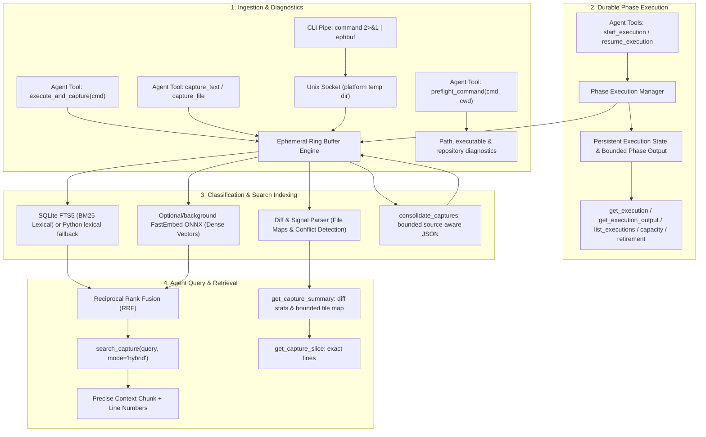

# Architecture and flow

```mermaid
flowchart TD
    subgraph Ingestion["1. Ingestion & Diagnostics"]
        A["CLI Pipe: command 2>&1 | ephbuf"] --> D["Unix Socket (platform temp dir)"]
        B["Agent Tool: execute_and_capture(cmd)"] --> E["Ephemeral Ring Buffer Engine"]
        C["Agent Tool: capture_text / capture_file"] --> E
        D --> E
        P["Agent Tool: preflight_command(cmd, cwd)"] --> Q["Path, executable & repository diagnostics"]
    end

    subgraph Execution["2. Durable Phase Execution"]
        X["Agent Tools: start_execution / resume_execution"] --> Y["Phase Execution Manager"]
        Y --> Z["Persistent Execution State & Bounded Phase Output"]
        Y --> E
        Z --> AA["get_execution / get_execution_output / list_executions / capacity / retirement"]
    end

    subgraph Indexing["3. Classification & Search Indexing"]
        E --> F["SQLite FTS5 (BM25 Lexical) or Python lexical fallback"]
        E --> G["Optional/background FastEmbed ONNX (Dense Vectors)"]
        E --> K["Diff & Signal Parser (File Maps & Conflict Detection)"]
        E --> M["consolidate_captures: bounded source-aware JSON"]
        M --> E
    end

    subgraph Querying["4. Agent Query & Retrieval"]
        F & G --> H["Reciprocal Rank Fusion (RRF)"]
        H --> I["search_capture(query, mode='hybrid')"]
        K --> L["get_capture_summary: diff stats & bounded file map"]
        L --> N["get_capture_slice: exact lines"]
        I --> J["Precise Context Chunk + Line Numbers"]
    end
```

---
